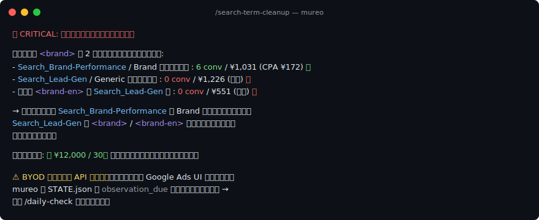
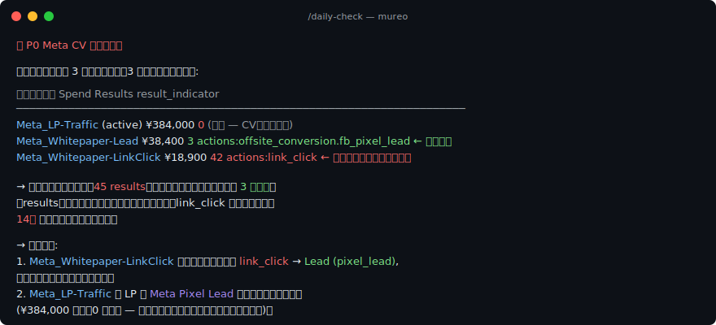

<p align="center">
  <picture>
    <source media="(prefers-color-scheme: dark)" srcset="docs/img/logo-dark.png">
    
  </picture>
</p>

<p align="center">
  <a href="https://mureo.io">Webサイト</a> ·
  <a href="README.md">English</a>
</p>

<p align="center">
  <a href="https://pypi.org/project/mureo/"></a>
  <a href="https://pypi.org/project/mureo/"></a>
  <a href="LICENSE"></a>
  <a href="https://github.com/logly/mureo/actions/workflows/ci.yml"></a>
</p>

**mureo** — ローカル完結・安全設計のAI広告運用フレームワーク。Claude Code、Codex、Cursor、Gemini に対応。

戦略を理解するエージェントが Google Ads、Meta Ads、Search Console、GA4 を自律的に分析・運用します。**認証情報は端末の外に出ません。**

## mureoとは

mureoは、AIエージェントが広告アカウントを自動運用するためのフレームワークです。インストールすると、AIエージェント（Claude Code、Cursor、Codex、Geminiなど）がGoogle広告・Meta広告・Search Console・GA4を横断して、配信診断・検索語分析・予算評価・入稿チェックなどを実行できるようになります。すべての操作はあなたのビジネス戦略（`STRATEGY.md`）に基づいて行われます。

mureoには学習の仕組みもあります。エージェントの分析を修正したり運用上の気づきを共有すると、`/learn` でナレッジベースに保存できます。保存した知識は次回以降のセッションで自動的に読み込まれるため、使い続けるほどエージェントがあなたのアカウントの特性を理解し、より的確な判断ができるようになります。

## mureoの始め方は2通り — BYOD（5分・OAuth不要）か Real-API（完全自動化）

> **Google Cloud Console や Meta for Developers に慣れていない方へ。** OAuth フロー / Developer Token の発行 / Business app 登録は、これらのコンソールを使ったことがない方には難しく感じるかもしれません。**まずは BYOD から始めてください** — 数分で mureo がどう動くかが分かります。それから real-API のセットアップに踏み込むかどうか判断すれば OK です。

### モード A: BYOD — 5分で最初の診断、OAuth 不要

**Google Ads / Meta Ads から XLSX（エクセルファイル）として書き出して mureo に取り込むだけで、媒体をまたいだ戦略レベルの診断が手に入ります。** OAuth・Developer Token・SaaSサインアップは一切不要です。

```bash
pip install mureo
mureo setup claude-code --skip-auth
mureo byod import ~/Downloads/mureo-google-ads.xlsx
mureo byod import ~/Downloads/mureo-meta-ads.xlsx     # Meta は後から追加可 — 互いに独立
# Claude Code を開いて「/daily-check を実行して」と聞く
```

XLSX の生成はプラットフォームごとの一回限りのセットアップです:

- **Google Ads** — Apps Script テンプレートで自分の Google スプレッドシートに出力 → XLSX としてダウンロード（約5分）。[ガイドを見る →](docs/byod.ja.md#step-2a--google-ads-script-を実行任意)
- **Meta Ads** — 広告マネージャの保存済みレポート → 2クリックで書き出し。**9言語に対応**（English / 日本語 / 简体中文 / 繁體中文 / 한국어 / Español / Português / Deutsch / Français）。広告マネージャUIを英語に切り替える必要はありません。[ガイドを見る →](docs/byod.ja.md#step-2b--meta-広告マネージャからエクスポート任意)

**設計として読み取り専用**。すべての変更系ツール（`/rescue`、`/budget-rebalance`、`/creative-refresh`）は `{"status": "skipped_in_byod_readonly"}` を返します — エージェントは分析・提案はしますが、実アカウントへの書き込みは決してしません。後から real API に切り替えるには `mureo byod remove --google-ads`（プラットフォーム単位）または `mureo byod clear`（全削除）。

### モード B: Real-API OAuth — 全機能対応

mureo を Google Ads / Meta Ads API に直接接続します。**実際に変更を実行する場合**（`/rescue`、`/budget-rebalance`、`/creative-refresh`、`mureo rollback apply`）、および GA4 / Search Console を使う場合は**必須**です。

```bash
pip install mureo
mureo auth setup           # ブラウザベースのOAuthウィザード
mureo setup claude-code    # MCP + ワークフローコマンド
# Claude Code を開いて「/daily-check を実行して」と聞く
```

前提: Google Ads Developer Token + OAuth クライアント、Meta App ID + Secret。ウィザードが両方を案内します — 下記の[認証](#認証)を参照。

### どちらのモードが合うか

| 機能                                                | モード A: BYOD                          | モード B: Real API |
|----------------------------------------------------|-----------------------------------------|------------------|
| **初回セットアップ時間**                           | **プラットフォームごとに5〜10分**      | 30〜60分 |
| **承認・待機リスク**                              | **なし**                                 | Google審査1〜3週間、却下される場合あり |
| `/daily-check`、`/weekly-report`                  | ✅（campaign / ad-set / ad のドリルダウン + プレースメント / プラットフォーム / デバイス内訳） | ✅ |
| `/goal-review`、`/sync-state`                     | ✅                                      | ✅ |
| `/rescue` / `/budget-rebalance`（提案）           | ✅                                      | ✅ |
| `/search-term-cleanup`（分析）                    | ✅ Google Ads のみ                      | ✅ |
| `/search-term-cleanup`（実行）                    | 🛡️ プレビューのみ                       | ✅ 実アカウントで実行 |
| `/rescue` / `/budget-rebalance`（実行）           | 🛡️ プレビューのみ                       | ✅ 実アカウントで実行 |
| `/creative-refresh`（実行）                       | 🛡️ プレビューのみ                       | ✅ 実アカウントで実行 |
| `/competitive-scan`                               | ⚠️ Google Ads BYOD は auction insights 非対応（Apps Script の制約） | ✅ |
| GA4 / Search Console                              | ❌（BYOD バンドルに含まれず）           | ✅ |

**おすすめの始め方:** まず1つのプラットフォームでモード A を試す → `/daily-check` を実行 → 2つ目のプラットフォームを BYOD で追加するか、モード B にアップグレードするか判断する。`~/.mureo/byod/manifest.json` があるかどうかでモードが切り替わります — 設定フラグもグローバル切替もありません。

詳細は [docs/byod.ja.md](docs/byod.ja.md) を参照してください — 完全ガイド、保存済みレポート設定、プラットフォーム別エクスポート手順を掲載しています。


## 特徴

### 戦略に基づいた判断

広告操作の前に、エージェントはまず `STRATEGY.md` を読みます。ペルソナ、USP、ブランドボイス、目標、運用モードなど、あなたのビジネス戦略が定義されたファイルです。数値だけを追いかけるのではなく、ビジネスの目的に沿った判断をします。

例えば `/creative-refresh` は、広告コピーを考える前にまずペルソナとUSPを確認します。`/budget-rebalance` は現在の運用モードを踏まえてから予算配分を提案します。`/rescue` はゴールの優先度に照らして、何から対処すべきかを判断します。

### 媒体横断の分析

Google広告、Meta広告、Search Console、GA4を1つのワークフローでまとめて処理します。

- `/daily-check` -- 全媒体の配信状況・広告パフォーマンス・自然検索のトレンド・サイト内行動を一括取得し、相関させて1つのレポートにまとめます。
- `/search-term-cleanup` -- 有料キーワードと自然検索の順位を突き合わせ、無駄な重複出稿を洗い出します。
- `/competitive-scan` -- オークション分析と自然検索の順位データを統合して、競合の全体像を把握します。

設定済みの媒体はエージェントが自動検出します。後からMeta広告を追加しても、全コマンドがそのまま対応します。

### 広告運用の専門知識

配信が出ない原因の自動特定（予算不足、入札設定ミス、広告の不承認など）、検索語の検索意図による分類、予算の使い方の効率評価、RSA広告の入稿チェックとアセットごとの成果分析、LPの解析、デバイス別のCPA差異の検出など、ベテラン運用者が経験で身につけている判断基準がワークフローに組み込まれています。

### 学習する運用ノウハウ

エージェントの分析を修正したり、運用で気づいたことを `/learn` でナレッジベースに保存できます。保存した知識は次回以降のセッションで自動的に読み込まれるため、同じ間違いを繰り返しません。1つのキャンペーンで得た知見が、アカウント内の似た状況にも活かされます。

```
あなた: 「それは本当のCPA悪化じゃない。この業界はGW期間は毎年こうなる」
エージェント: 保存します。次回同じパターンを検知したら季節要因として報告します。

→ ナレッジベースに記録
→ 以降の /daily-check や /rescue で自動的に考慮
```

### セキュリティ設計

AIエージェントに広告アカウントを任せる以上、認証情報の漏洩や暴走は無視できないリスクです。mureo はこの前提に立って、いくつかの防御を最初から組み込んでいます。

- **認証情報の保護** — `mureo setup claude-code` が `~/.claude/settings.json` に PreToolUse フックを追加し、`~/.mureo/credentials.json` や `.env` などの秘密ファイルをエージェントが読み取れないようにします。プロンプトインジェクションでトークンが盗まれる経路を塞ぎます。
- **GAQL の入力チェック** — Google Ads クエリに渡される ID・日付・期間指定・文字列は、すべて `mureo/google_ads/_gaql_validator.py` のホワイトリスト検証を通ります。`BETWEEN` 句もそのまま流さず、日付部分を切り出して再検証します。
- **異常の自動検知** — `mureo/analysis/anomaly_detector.py` が action_log の履歴から中央値で基準値を作り、いまのキャンペーン指標と比べて「支出がゼロ」「CPA が跳ねた」「CTR が落ちた」を優先度つきで通知します。サンプル数が少ない日は単日のノイズとして扱い、誤検知を抑えます。エージェントは MCP ツール `analysis.anomalies.check` から呼び出せます。`state_file` 引数は MCP サーバの作業ディレクトリ配下にサンドボックスされ、`..` による親ディレクトリ越えや、サンドボックス外を指すシンボリックリンクは拒否されます。これにより、プロンプトインジェクションされたエージェントが攻撃者が用意した別の `STATE.json` を読み込ませることはできません。
- **ロールバック（許可リスト制）** — `mureo/rollback/` が action_log に記録された `reversible_params` を解釈して、取り消しプランを組み立てます。対象にできる操作はあらかじめ許可リスト登録したものだけ。`.delete` / `.remove` / `.transfer` など破壊的なメソッドや、想定外のパラメータキーは拒否されるので、乗っ取られたエージェントが「取り消し」に見せかけて危険な操作を仕込むことはできません。`mureo rollback list` / `show` で実行前に内容を確認でき、実行は MCP ツール `rollback.apply` として提供されます。apply は通常の操作と同じハンドラ経由でディスパッチされるため、認証・レート制限・入力検証ゲートをそのまま通ります。`confirm=true`（真偽値の `True`）を明示的に渡す必要があり、成功すると `rollback_of=<index>` タグ付きの追記専用ログが残ります。同じ index に対する二度目の apply は拒否され、`rollback.*` へのツール再帰も拒否されます。
- **状態データの不変性** — `StateDocument` や `ActionLogEntry`、`RollbackPlan` など状態を表すクラスはすべて `frozen=True` の dataclass です。エージェントが自分で書いた記録を後から書き換えることはできません。
- **認証情報はローカルのみ** — トークンは `~/.mureo/credentials.json` か環境変数から読むだけで、送信先は Google Ads / Meta / Search Console の公式 API に限定しています。mureo 側はテレメトリを一切送りません。

脅威モデルと脆弱性報告の手順は [SECURITY.md](SECURITY.md) を参照してください。

<details>
<summary>全機能一覧を展開</summary>

| 領域 | 機能 |
|------|------|
| **診断** | 配信停止・低下の原因自動特定、学習期間の検出、入札戦略の分類、CV未発生キャンペーンの原因分析 |
| **パフォーマンス** | 期間比較、コスト急騰の原因調査、アカウント全体の健全性チェック、CPA/CV目標の進捗追跡 |
| **検索語** | N-gram分布、検索意図の分類、追加/除外候補の自動評価、有料 vs 自然検索の重複分析 |
| **クリエイティブ** | RSA入稿チェック（禁止表現、文字幅、広告の有効性予測）、アセット別の成果分析、LP解析、広告とLPの一貫性チェック |
| **予算** | キャンペーン横断の配分分析、再配分の提案、予算効率の評価 |
| **競合** | オークション分析、インプレッションシェアの推移、自然検索順位との相関 |
| **Meta広告** | 配置別分析（Facebook/Instagram/Audience Network）、コスト悪化の原因調査、A/B比較、クリエイティブ改善提案 |
| **モニタリング** | 配信目標の達成度評価、CPA/CV目標の追跡、デバイス別分析、B2B向けチェック |

</details>

## ワークフローコマンド

| コマンド | できること |
|---------|----------|
| `/onboard` | 接続媒体の検出、STRATEGY.md（戦略ファイル）の作成、STATE.json（状態ファイル）の初期化 |
| `/daily-check` | 全媒体の配信状況・成果を一括チェック。自然検索やサイト行動データがあれば相関分析も実施 |
| `/rescue` | パフォーマンス急落時の緊急対応。広告側の問題かサイト側の問題かを切り分け |
| `/search-term-cleanup` | 検索語の整理。自然検索との重複や無駄な出稿の洗い出し |
| `/creative-refresh` | ペルソナ・USP・自然検索キーワードを踏まえた広告コピーの更新 |
| `/budget-rebalance` | 自然検索でカバーできている領域を考慮した予算の再配分 |
| `/competitive-scan` | 広告と自然検索の両面から競合状況を分析 |
| `/goal-review` | 複数媒体・データソースを横断した目標進捗の評価。運用方針の変更を提案 |
| `/weekly-report` | 全媒体を横断した週次レポートの作成 |
| `/sync-state` | STATE.jsonを各媒体の最新データで更新 |
| `/learn` | 運用で得た知見をナレッジベースに保存。次回以降のセッションに自動で反映 |

### はじめ方

```bash
pip install mureo
mureo setup claude-code

# Claude Code上で：
/onboard          # 初回：戦略と状態をセットアップ
/daily-check      # 日次：全キャンペーンをチェック
/rescue           # パフォーマンス悪化時
```

### 例：`/creative-refresh` の実行フロー

```
あなた: /creative-refresh

エージェントがSTRATEGY.mdを読み込む:
  ペルソナ: "予算制約のあるSaaSマーケター"
  USP: "AIで広告運用工数を週10時間削減"
  ブランドボイス: "データ駆動、誇張なし"

STATE.jsonから接続媒体を検出:
  → Google広告 + Meta広告

各媒体・データソースからデータを取得:
  → クリエイティブ監査     → Google広告で成果の低いアセット3件
  → LP解析               → 訴求ポイント：無料トライアル、ROI改善
  → Search Console        → "広告運用自動化"が自然検索で高クリック
  → GA4                   → 料金ページの直帰率が高い

戦略に沿って広告コピーを作成:
  Google広告: "AIで広告運用時間60%削減"     ← ペルソナの課題から着想
  Meta広告:   "広告レポート地獄からの脱出..." ← ブランドボイスに合わせたSNS向けの表現

入稿チェック後、承認を求める:
  "Google広告の見出し3件とMeta広告2件の差し替えを提案します。理由は..."

あなたが承認 → 各媒体の広告を更新。
```

### 実際のアウトプット例（B2B SaaS アカウント、匿名化済）

ある日本の B2B SaaS アカウントで 30日分の BYOD バンドルを使って実行した、実際の診断結果の抜粋です。キャンペーン名・広告グループ名は匿名化、ブランド検索語は `<brand>` に置換しています。数値は実値のまま。

**`/search-term-cleanup` — ブランドカニバリゼーションを自動検出**



なぜ意味があるのか: 数値しか見ないツールは「同じ検索語」を重複扱いして単純に直近を残します。mureo は STRATEGY.md を読み、「2つのキャンペーンは異なる意図 (ブランド指名 vs 汎用リード獲得) で運用されている」と認識して、コンバージョンする側に流すべきだと判断します — **CPA 7倍** の差を放置しなくなる。

**`/daily-check` — Meta の CV 定義不整合を自動検出**



なぜ意味があるのか: `link_click` 最適化と `pixel_lead` 最適化の違いは、ダッシュボード上の数値だけ見ても気づけません。mureo は `result_indicator` をキャンペーン単位で取得するため、エージェントは「結果」列を比較する**前**に単位の違いを認識し、予算判断の前にトラッキング設定の問題として正しく分類できます。

## クイックスタート

### 事前に必要なもの

- **Google広告** — [Google Ads API の Developer Token](https://developers.google.com/google-ads/api/docs/get-started/dev-token) と、OAuth用の Client ID / Client Secret
- **Meta広告** — [Meta for Developers](https://developers.facebook.com/) でアプリを作成し、App ID / App Secret を取得（開発モードのままで構いません）

いずれも `mureo auth setup` の対話型ウィザードが手順を案内します。

### ブラウザベースの認証ウィザード (`mureo auth setup --web`)

ターミナルに長い秘密情報を貼り付けるのはミスしやすいので、インストール後は `mureo auth setup --web` を実行してください。短命のローカルウィザードが `http://127.0.0.1:<ランダムポート>/` で起動し、ブラウザが自動で開いて Developer Token・App ID・App Secret を貼り付けるフォームが表示されます（各欄のリンクから Google Cloud Console / Google Ads API Center / Meta for Developers の該当ページに飛べます）。同じブラウザウィンドウで OAuth を完了すると `~/.mureo/credentials.json` に書き込まれます。

<details>
<summary>ウィザードをローカル実行しても安全な理由</summary>

サーバは `127.0.0.1` のランダムポートにのみバインドします。フォームは CSRF トークンで保護（submit成功後に自動ローテーション）、OAuth の `state` パラメータはコールバック時に `secrets.compare_digest` で検証、`Host` ヘッダのアローリストでDNSリバインディング攻撃をブロック、リダイレクト先は `https://accounts.google.com/` と `https://www.facebook.com/` にピン留めしてあるためオープンリダイレクトは成立せず、認証情報の保存後は session 上の秘密情報をゼロクリアします。POST ボディは 16 KiB で打ち切り、`/done` 画面が配信されたらサーバを停止します。依存は標準ライブラリのみで、外部 Web フレームワークのサプライチェーン侵害を受ける面はありません。

</details>

### Claude Code（推奨）

```bash
pip install mureo
mureo setup claude-code
```

このコマンド1つですべて完了します：
1. Google広告 / Meta広告の認証（OAuth）
2. Claude Code用のMCPサーバー設定
3. 認証情報ガード（AIエージェントが認証ファイルを読めないようにブロック）
4. ワークフローコマンド（`/daily-check`、`/rescue`、`/learn` など）
5. スキル（ツールリファレンス、戦略ガイド、判断の仕組み、診断ナレッジ）

セットアップ後、Claude Codeで `/onboard` を実行してください。

### Cursor

```bash
pip install mureo
mureo setup cursor
```

CursorはMCPツールを利用できますが、ワークフローコマンドとスキルには対応していません。

### Codex CLI

```bash
pip install mureo
mureo setup codex
```

Claude Codeと同じく4層すべて（MCPサーバー、認証情報ガード（PreToolUseフック）、ワークフローコマンド、スキル）を `~/.codex/` 配下にインストールします。ワークフローコマンドは Codex スキル形式（`~/.codex/skills/<command>/SKILL.md`）としてインストールされ、`$daily-check` または `/skills` ピッカーから呼び出せます（Codex CLI 0.117.0 以降は `~/.codex/prompts/` を読み込まなくなりました。[openai/codex#15941](https://github.com/openai/codex/issues/15941)）。

### Gemini CLI

```bash
pip install mureo
mureo setup gemini
```

mureoをGemini CLIのextensionとして `~/.gemini/extensions/mureo/` に登録し、MCPサーバー設定と `CONTEXT.md` をコンテキストファイルとして指定します。Gemini CLIはPreToolUseフックと`.md`形式のコマンドに対応していないため、これらのレイヤーはインストールされません。

### CLIのみ（認証管理）

```bash
pip install mureo
mureo auth setup
mureo auth status
```

### Docker

mureoのMCPサーバーを隔離されたコンテナで動かせます。想定ユースケース:

- **Claude Code以外のMCPクライアント**: Cursor, Codex CLI, Gemini CLI, Continue, Cline, Zed など
- **CI/CDパイプライン**: 異常検知、ロールバック dry-run、週次レポートの自動実行
- **マルチテナント / 代理店運用**: クライアントごとにコンテナ・認証情報を分離
- **MCPレジストリの健全性チェック**（Glama 等）

> スラッシュコマンド（`/daily-check`, `/rescue` など）と credential-guard フックは Claude Code 固有のUXです。これらを使う場合は `pip install mureo` + `mureo setup claude-code` を使ってください。

#### ビルドと起動

```bash
docker build -t mureo .
docker run --rm -v ~/.mureo:/home/mureo/.mureo mureo
```

MCPクライアント側の設定で上記 `docker run` をコマンドとして指定してください。

#### 認証

認証情報は `/home/mureo/.mureo/credentials.json`（コンテナ内、bind mount 経由）または環境変数から読み込まれます。3つの方式から選べます:

**1. マウントした認証ファイル** — ホストに `~/.mureo/credentials.json` が既にある場合（`mureo auth setup` 実行済、チーム共有、手書き等）、上記の bind mount だけで十分です。

手書き用スキーマ:

```json
{
  "google_ads": {
    "developer_token": "...",
    "client_id": "...apps.googleusercontent.com",
    "client_secret": "...",
    "refresh_token": "...",
    "login_customer_id": "1234567890"
  },
  "meta_ads": { "access_token": "..." }
}
```

必須フィールド: Google は `developer_token` / `client_id` / `client_secret` / `refresh_token`、Meta は `access_token`。Search Console は Google の OAuth 認証情報を共用（OAuth アプリに `https://www.googleapis.com/auth/webmasters` スコープが必要）。

**2. 環境変数** — CI/CDで secret manager から渡す場合に便利:

```bash
docker run --rm \
  -e GOOGLE_ADS_DEVELOPER_TOKEN=... \
  -e GOOGLE_ADS_CLIENT_ID=... \
  -e GOOGLE_ADS_CLIENT_SECRET=... \
  -e GOOGLE_ADS_REFRESH_TOKEN=... \
  -e GOOGLE_ADS_LOGIN_CUSTOMER_ID=... \
  -e META_ADS_ACCESS_TOKEN=... \
  mureo
```

対応環境変数: `GOOGLE_ADS_{DEVELOPER_TOKEN, CLIENT_ID, CLIENT_SECRET, REFRESH_TOKEN, LOGIN_CUSTOMER_ID, CUSTOMER_ID}`, `META_ADS_{ACCESS_TOKEN, APP_ID, APP_SECRET, TOKEN_OBTAINED_AT, ACCOUNT_ID}`。

**3. Docker内で対話型ウィザード実行** — OAuthトークンをまだ持っておらず、ホストにmureoをインストールしたくない場合:

```bash
docker run -it --rm -v ~/.mureo:/home/mureo/.mureo mureo mureo auth setup
```

ターミナル上でOAuthフローを案内します。`credentials.json` はマウントボリュームに書き出されるので、次回以降は方式1で起動できます。

mureo以外でOAuthトークンを取得する方法:

- Google Ads OAuth 2.0: https://developers.google.com/google-ads/api/docs/oauth/overview
- Meta 長期アクセストークン: https://developers.facebook.com/docs/facebook-login/guides/access-tokens/get-long-lived

### インストール内容

| 構成要素 | `mureo setup claude-code` | `mureo setup cursor` | `mureo setup codex` | `mureo setup gemini` | `mureo auth setup` |
|---------|:---:|:---:|:---:|:---:|:---:|
| 認証（~/.mureo/credentials.json） | Yes | Yes | Yes | Yes | Yes |
| MCP設定 | Yes | Yes | Yes | Yes | Yes |
| 認証情報ガード（PreToolUseフック） | Yes | N/A | Yes | N/A | Yes |
| ワークフローコマンド | Yes（~/.claude/commands/） | N/A | Yes（~/.codex/skills/ — `$cmd`または`/skills`で起動） | N/A | No |
| スキル | Yes（~/.claude/skills/） | N/A | Yes（~/.codex/skills/） | N/A | No |
| Extensionマニフェスト（contextFileName） | N/A | N/A | N/A | Yes（~/.gemini/extensions/mureo/） | No |

### スキル一覧

| スキル | 内容 |
|-------|------|
| `mureo-google-ads` | Google広告ツールのリファレンス |
| `mureo-meta-ads` | Meta広告ツールのリファレンス |
| `mureo-shared` | 認証、セキュリティルール、出力フォーマット |
| `mureo-strategy` | STRATEGY.md / STATE.json の仕様と使い方 |
| `mureo-workflows` | 運用モード、KPI閾値、コマンドリファレンス |
| `mureo-learning` | データに基づく判断の仕組み（観察期間、サンプルサイズ、ノイズの排除） |
| `mureo-pro-diagnosis` | 運用で蓄積するナレッジベース（`/learn` で記録） |

### GA4（Google Analytics 4）の接続

GA4のMCPサーバーを接続すると、ワークフローコマンドがコンバージョン率やユーザー行動のデータも自動で取り込みます。GA4がなくても全コマンドは動作します。

[Google Analytics MCP](https://github.com/googleanalytics/google-analytics-mcp) を使ったセットアップ手順：

1. GCPプロジェクトで以下のAPIを有効化（リンクをクリックして「有効にする」）：
   - [Google Analytics Admin API](https://console.cloud.google.com/apis/library/analyticsadmin.googleapis.com)
   - [Google Analytics Data API](https://console.cloud.google.com/apis/library/analyticsdata.googleapis.com)

2. インストールと認証：

   ```bash
   pipx install analytics-mcp

   gcloud auth application-default login \
     --scopes https://www.googleapis.com/auth/analytics.readonly,https://www.googleapis.com/auth/cloud-platform
   ```

3. `~/.claude/settings.json` にmureoと並列で追加：

   ```json
   {
     "mcpServers": {
       "mureo": {
         "command": "python",
         "args": ["-m", "mureo.mcp"]
       },
       "analytics-mcp": {
         "command": "pipx",
         "args": ["run", "analytics-mcp"],
         "env": {
           "GOOGLE_APPLICATION_CREDENTIALS": "/path/to/application_default_credentials.json",
           "GOOGLE_PROJECT_ID": "your-gcp-project-id"
         }
       }
     }
   }
   ```

### その他のMCPサーバー

mureoは他のMCPサーバーと併用できます。CRMツールなどのMCPを同じセッションに追加すれば、ワークフローコマンドがそのデータも活用します。詳細は [docs/integrations.md](docs/integrations.md) を参照してください。

## 認証

### セットアップ（推奨）

```bash
mureo auth setup
```

対話型のウィザードが案内します：

1. **Google広告** — Developer Token + Client ID/Secret を入力 → ブラウザでOAuth → アカウント選択
2. **Meta広告** — App ID/Secret を入力 → ブラウザでOAuth → 広告アカウント選択。Metaアプリは**開発モードのまま**で問題ありません（App Reviewは不要です）。OAuthの際に `business_management` の権限警告が表示されますが、ビジネスポートフォリオ経由のページ管理に必要なため、そのまま承認してください。
3. **MCP設定** — Claude Code / Cursor / Codex / Gemini用の設定ファイルを自動生成

認証情報は `~/.mureo/credentials.json` に保存されます。Search ConsoleはGoogle広告と同じOAuth認証を使うため、追加の設定は不要です。

### 環境変数（代替手段）

| 媒体 | 変数 | 必須 |
|------|------|-----|
| Google広告 | `GOOGLE_ADS_DEVELOPER_TOKEN` | はい |
| Google広告 | `GOOGLE_ADS_CLIENT_ID` | はい |
| Google広告 | `GOOGLE_ADS_CLIENT_SECRET` | はい |
| Google広告 | `GOOGLE_ADS_REFRESH_TOKEN` | はい |
| Google広告 | `GOOGLE_ADS_LOGIN_CUSTOMER_ID` | いいえ |
| Meta広告 | `META_ADS_ACCESS_TOKEN` | はい |
| Meta広告 | `META_ADS_APP_ID` | いいえ |
| Meta広告 | `META_ADS_APP_SECRET` | いいえ |

### 確認

```bash
mureo auth status          # 認証状態の確認
mureo auth check-google    # Google広告の認証情報を表示（マスク済み）
mureo auth check-meta      # Meta広告の認証情報を表示（マスク済み）
```

## ツール一覧

- **Google広告** — キャンペーン（検索/ディスプレイ）、広告グループ、検索広告（RSA）、ディスプレイ広告（RDA）、キーワード、予算、検索語、分析、RSA監査、B2B最適化、モニタリングなど
- **Meta広告** — キャンペーン、広告セット、広告、クリエイティブ、オーディエンス、Conversions API、商品カタログ、リード広告など
- **Search Console** — サイト管理、検索アナリティクス、URL検査、サイトマップ

全ツールの詳細は [英語版README](README.md#tool-list) を参照してください。

## 設計方針

- **データベース不要** — 状態は広告プラットフォームのAPIまたはローカルファイルに保持
- **LLMを内蔵しない** — mureoはデータの取得と分析を担当し、判断はエージェント側が行います
- **データは不変** — すべてのデータモデルで `frozen=True` を使用し、意図しない変更を防止
- **認証情報はローカルに保存** — 公式の広告プラットフォームAPI以外には一切送信しません

ディレクトリ構造の詳細は [docs/architecture.md](docs/architecture.md) を参照してください。

## 開発

```bash
git clone https://github.com/logly/mureo.git && cd mureo
pip install -e ".[dev]"
pytest tests/ -v                              # テスト実行
pytest --cov=mureo --cov-report=term-missing  # カバレッジ付き
ruff check mureo/ && black mureo/ && mypy mureo/  # lint & format
```

Python 3.10以上が必要です。詳細は [CONTRIBUTING.md](CONTRIBUTING.md) を参照してください。

## ライセンス

Apache License 2.0
