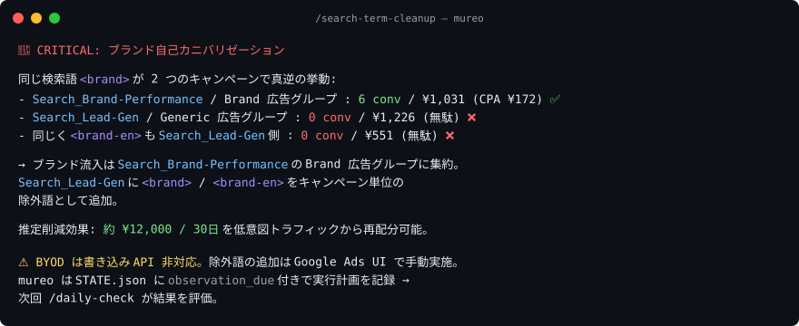
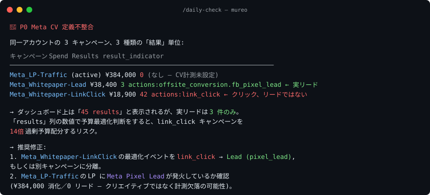

<p align="center">
  <picture>
    <source media="(prefers-color-scheme: dark)" srcset="docs/img/logo-dark.png">
    
  </picture>
</p>

<p align="center">
  <a href="https://mureo.io">Webサイト</a> ·
  <a href="https://mureo.jp">商用版</a> ·
  <a href="README.md">English</a>
</p>

<p align="center">
  <a href="https://pypi.org/project/mureo/"></a>
  <a href="https://pypi.org/project/mureo/"></a>
  <a href="LICENSE"></a>
  <a href="https://github.com/logly/mureo/actions/workflows/ci.yml"></a>
</p>

**mureo** — ローカルで動く、AI広告運用チーム。無駄を見つけ、変更を監査し、安全に運用する。

_ローカルファースト・戦略準拠・セーフティゲート。_

Claude Code、Cursor、Codex、Gemini に対応。mureo は各広告プラットフォームの公式 MCP の上に乗り、AI に守るべき戦略・測るべき成果・誰にでも見せられる監査証跡を与えます。**認証情報は端末の外に出ません。**

> チーム・代理店向けの商用版（クラウド版／ローカルで動く Agency 版）もご用意しています。詳しくは **[mureo.jp](https://mureo.jp)** をご覧ください。

<p align="center">
  
</p>

<p align="center"><em>実出力: 30日分の BYOD バンドルでブランドカニバリゼーションを自動検出 (B2B SaaS アカウント、匿名化済)。<a href="#実際のアウトプット例b2b-saas-アカウント匿名化済">他のサンプルを見る ↓</a></em></p>

## mureoとは

mureoは、**AI 広告運用のためのローカル制御平面（control plane）** です。インストールすると、AIエージェント（Claude Code、Cursor、Codex、Geminiなど）が Google 広告・Meta 広告・TikTok 広告・Search Console・GA4 を *mureo を経由して* 操作できるようになります。すべての判断はあなたの事業戦略に基づき、実際の成果に紐づき、後から再生可能な監査ログに残ります。

各広告プラットフォームの公式 MCP（Meta Ads MCP / Google Ads MCP など）が出揃うと、mureo はそれらをドライバとして利用します。mureo の価値は API 接続そのものではなく、**その周辺で起きること**にあります。

- **戦略準拠** — すべての判断が `STRATEGY.md`（ペルソナ・USP・ブランドボイス・目標）を読み込む
- **セーフティゲート** — rollback allow-list、GAQL ガード、BYOD 既定 read-only、認証情報ガード、プラットフォーム別スロットリング
- **クロスプラットフォーム** — Google 広告 / Meta 広告 / TikTok 広告 / Search Console / GA4 を 1 つのワークフローで
- **監査可能** — 追記専用 action log、rollback 対応
- **ローカルファースト** — 認証情報は端末の外に出ない
- **学習可能** — `/learn` でアカウント固有のナレッジを継続的に蓄積

## クイックスタート（2分で動きを見る）

広告アカウントの認証情報も、OAuth も、サインアップも不要です。3 コマンドで合成データのデモアカウントが用意され、mureo が Claude Code に接続されます。

```bash
pip install mureo
mureo setup claude-code --skip-auth
mureo demo init --scenario seasonality-trap
```

生成された `mureo-demo/` ディレクトリを Claude Code で開いて、こう聞いてください。

```
/daily-check
```

エージェントがデモ用の `STRATEGY.md` を読み、キャンペーンデータを取得し、数値だけを見るツールが見落とす「季節性の罠」に踏み込んでいく様子を見られます。次は `/search-term-cleanup` を試してみてください。

自分のデータに mureo を向ける準備ができたら、下の 2 つの道のどちらかを選びます。

### 道 A: 自分のデータで試す（BYOD、5〜10分、OAuth 不要）

**Google Ads / Meta Ads から XLSX として書き出して mureo に取り込むだけで、媒体をまたいだ戦略レベルの診断が手に入ります。** OAuth も Developer Token の審査待ちも一切不要です。

```bash
mureo byod import ~/Downloads/mureo-google-ads.xlsx
mureo byod import ~/Downloads/mureo-meta-ads.xlsx   # 媒体は互いに独立。片方だけでも、後から追加でも可
# Claude Code を開いて「/daily-check を実行して」と聞く
```

XLSX の生成は媒体ごとに一回だけのセットアップです。Google Ads は Apps Script テンプレートで約5分、Meta Ads は広告マネージャの保存済みレポートから2クリックで書き出せます（9言語のUIに対応。広告マネージャを英語に切り替える必要はありません）。**[BYOD ガイド →](docs/byod.ja.md)**

BYOD は**設計として読み取り専用**です。すべての変更系ツールは `{"status": "skipped_in_byod_readonly"}` を返します。エージェントは分析と提案はしますが、実アカウントへの書き込みは決してしません。

### 道 B: 本番接続する（Live API OAuth、全機能）

mureo を Google Ads / Meta Ads API に直接接続します。実際に変更を実行する場合（`/rescue`、`/budget-rebalance`、`/creative-refresh`、rollback）、および GA4 / Search Console を使う場合はこちらが必須です。

```bash
mureo configure
```

`mureo configure` はローカル（`127.0.0.1` にバインド。外部からはアクセス不可）にブラウザ UI を起動し、Claude アプリの選択、1クリックの基本セットアップ、各コンソールへのディープリンク付き Google / Meta OAuth、公式 MCP プロバイダの登録まで案内します。ターミナル派には `mureo auth setup` ＋ `mureo setup claude-code` が同じことをします。**[認証ガイド →](docs/authentication.md)**

前提: Google Ads の Developer Token と OAuth クライアント、Meta の App ID と Secret（開発モードのままで構いません）。取得手順もウィザードが案内します。

> **Google Cloud Console や Meta for Developers に慣れていない方へ。** OAuth フローや Developer Token の発行は、これらのコンソールを使ったことがない方には難しく感じるかもしれません。**まずはデモか BYOD から始めてください。**数分で mureo がどう動くかが分かり、それから Live API のセットアップに踏み込むかどうか判断すれば大丈夫です。

### どちらのモードが合うか

| 機能                                                | BYOD                                    | Live API |
|----------------------------------------------------|-----------------------------------------|------------------|
| **初回セットアップ時間**                           | **プラットフォームごとに5〜10分**      | 30〜60分 |
| **承認・待機リスク**                              | **なし**                                 | Google審査1〜3週間、却下される場合あり |
| `/daily-check`、`/weekly-report`                  | ✅（campaign / ad-set / ad のドリルダウン + プレースメント / プラットフォーム / デバイス内訳） | ✅ |
| `/goal-review`、`/sync-state`                     | ✅                                      | ✅ |
| `/rescue` / `/budget-rebalance`（提案）           | ✅                                      | ✅ |
| `/search-term-cleanup`（分析）                    | ✅ Google Ads のみ                      | ✅ |
| 実行（`/rescue`、`/budget-rebalance`、`/creative-refresh`、`/search-term-cleanup`） | 🛡️ プレビューのみ | ✅ 実アカウントで実行 |
| `/competitive-scan`                               | ⚠️ Google Ads BYOD は auction insights 非対応（Apps Script の制約） | ✅ |
| GA4 / Search Console                              | ❌（BYOD バンドルに含まれず）           | ✅ |

`~/.mureo/byod/manifest.json` があるかどうかでモードが切り替わります。取り込んだ媒体は BYOD、それ以外は Live API で動作し、`mureo byod remove --google-ads`（媒体単位）や `mureo byod clear`（全削除）でいつでも切り替えられます。

### そのほかのエージェントとホスト

基準となるホストは Claude Code ですが、どのセットアップも 1 コマンドで完了します。

| ホスト | コマンド | 補足 |
|------|---------|-------|
| Claude Code | `mureo setup claude-code` | MCP サーバ＋認証情報ガード＋ワークフロースキル |
| Claude Desktop（Chat / Cowork） | `mureo install-desktop` | Cowork ではワークスペースフォルダを接続 |
| Cursor | `mureo setup cursor` | MCP ツールのみ（ワークフロースキルなし） |
| Codex CLI | `mureo setup codex` | Claude Code と同等。スキルは `~/.codex/skills/` に配置、`$daily-check` で起動 |
| Gemini CLI | `mureo setup gemini` | 拡張マニフェスト形式。PreToolUse フックは非対応 |
| 任意の MCP クライアント / CI | Docker | **[Docker ガイド →](docs/docker.md)** |

ホスト別の詳細手順（各ホストのデモ / BYOD / Live の組み合わせを含む）: **[はじめかた →](docs/getting-started.ja.md)**

## 特徴

### 戦略に基づいた判断

広告操作の前に、エージェントはまず `STRATEGY.md` を読みます。ペルソナ、USP、ブランドボイス、目標、運用モードなど、あなたのビジネス戦略が定義されたファイルです。数値だけを追いかけるのではなく、ビジネスの目的に沿った判断をします。

例えば `/creative-refresh` は、広告コピーを考える前にまずペルソナとUSPを確認します。`/budget-rebalance` は現在の運用モードを踏まえてから予算配分を提案します。`/rescue` はゴールの優先度に照らして、何から対処すべきかを判断します。

### 媒体横断の分析

Google広告、Meta広告、TikTok広告、Search Console、GA4を1つのワークフローでまとめて処理します。

- `/daily-check` -- 全媒体の配信状況・広告パフォーマンス・自然検索のトレンド・サイト内行動を一括取得し、相関させて1つのレポートにまとめます。
- `/search-term-cleanup` -- 有料キーワードと自然検索の順位を突き合わせ、無駄な重複出稿を洗い出します。
- `/competitive-scan` -- オークション分析と自然検索の順位データを統合して、競合の全体像を把握します。

設定済みの媒体はエージェントが自動検出します。後からMeta広告やTikTok広告を追加しても、全コマンドがそのまま対応します。

### 広告運用の専門知識

配信が出ない原因の自動特定（予算不足、入札設定ミス、広告の不承認など）、検索語の検索意図による分類、予算の使い方の効率評価、RSA広告の入稿チェックとアセットごとの成果分析、LPの解析、デバイス別のCPA差異の検出など、ベテラン運用者が経験で身につけている判断基準がワークフローに組み込まれています。

### クリエイター品質のクリエイティブ生成

`/creative-generate` は、クリエイターが作ったものと遜色ない広告クリエイティブを生成します。自分の API キーで使う画像プロバイダで文字なしのキービジュアルを作り、HTML/CSS ＋ ヘッドレス Chromium で日本語タイポグラフィをピクセル単位で合成。しかもエージェントが全候補を採点してから納品します。詳細は [docs/creative-studio.ja.md](docs/creative-studio.ja.md)。

### 学習する運用ノウハウ

エージェントの分析を修正したり、運用で気づいたことを `/learn` でナレッジベースに保存できます。保存した知識は次回以降のセッションで自動的に読み込まれるため、同じ間違いを繰り返しません。1つのキャンペーンで得た知見が、アカウント内の似た状況にも活かされます。

```
あなた: 「それは本当のCPA悪化じゃない。この業界はGW期間は毎年こうなる」
エージェント: 保存します。次回同じパターンを検知したら季節要因として報告します。

→ ナレッジベースに記録
→ 以降の /daily-check や /rescue で自動的に考慮
```

ローカルの `/learn` 履歴に加え、mureo は **外部の advisor MCP サーバー** に問い合わせることもできます。コンサルファーム、業界団体、OSS コミュニティ、社内 wiki などがベクトル検索ベースの advisor MCP を立てれば、LLM が持っていない実務ノウハウ（媒体仕様の癖、業界別 CPA / CTR ベンチマーク、学習データ cutoff 以降の媒体アップデート等）をエージェントが取り込めるようになります。`~/.mureo/insight_sources.json` で設定すれば、診断 skill 実行時にエージェントが `mureo_consult_advisor` を呼び出して該当する断片だけを取得します。コーパス自体は advisor 側に残り、mureo は文脈付きクエリを送って top-k 件の関連スニペットを受け取る方式です。詳細は [`docs/insight-federation.ja.md`](docs/insight-federation.ja.md) を参照してください（オペレーター向けセットアップ + サーバー実装者向け仕様書）。

### セキュリティ設計

AIエージェントに広告アカウントを任せる以上、認証情報の漏洩や暴走は無視できないリスクです。mureo はこの前提に立って、いくつかの防御を最初から組み込んでいます。

- **認証情報の保護** — `mureo setup claude-code` が `~/.claude/settings.json` に PreToolUse フックを追加し、`~/.mureo/credentials.json` や `.env` などの秘密ファイルをエージェントが読み取れないようにします。プロンプトインジェクションでトークンが盗まれる経路を塞ぎます。
- **GAQL の入力チェック** — Google Ads クエリに渡される ID・日付・期間指定・文字列は、すべて `mureo/google_ads/_gaql_validator.py` のホワイトリスト検証を通ります。`BETWEEN` 句もそのまま流さず、日付部分を切り出して再検証します。
- **異常の自動検知** — `mureo/analysis/anomaly_detector.py` が action_log の履歴から中央値で基準値を作り、いまのキャンペーン指標と比べて「支出がゼロ」「CPA が跳ねた」「CTR が落ちた」を優先度つきで通知します。サンプル数が少ない日は単日のノイズとして扱い、誤検知を抑えます。エージェントは MCP ツール `analysis_anomalies_check` から呼び出せます。`state_file` 引数は MCP サーバの作業ディレクトリ配下にサンドボックスされ、`..` による親ディレクトリ越えや、サンドボックス外を指すシンボリックリンクは拒否されます。これにより、プロンプトインジェクションされたエージェントが攻撃者が用意した別の `STATE.json` を読み込ませることはできません。
- **ロールバック（許可リスト制）** — `mureo/rollback/` が action_log に記録された `reversible_params` を解釈して、取り消しプランを組み立てます。対象にできる操作はあらかじめ許可リスト登録したものだけ。`.delete` / `.remove` / `.transfer` など破壊的なメソッドや、想定外のパラメータキーは拒否されるので、乗っ取られたエージェントが「取り消し」に見せかけて危険な操作を仕込むことはできません。`mureo rollback list` / `show` で実行前に内容を確認でき、実行は MCP ツール `rollback_apply` として提供されます。apply は通常の操作と同じハンドラ経由でディスパッチされるため、認証・レート制限・入力検証ゲートをそのまま通ります。`confirm=true`（真偽値の `True`）を明示的に渡す必要があり、成功すると `rollback_of=<index>` タグ付きの追記専用ログが残ります。同じ index に対する二度目の apply は拒否され、`rollback.*` へのツール再帰も拒否されます。
- **状態データの不変性** — `StateDocument` や `ActionLogEntry`、`RollbackPlan` など状態を表すクラスはすべて `frozen=True` の dataclass です。エージェントが自分で書いた記録を後から書き換えることはできません。
- **認証情報はローカルのみ** — トークンは `~/.mureo/credentials.json` か環境変数から読むだけで、送信先は Google Ads / Meta / Search Console の公式 API に限定しています。mureo 側はテレメトリを一切送りません。

脅威モデルと脆弱性報告の手順は [SECURITY.md](SECURITY.md) を参照してください。

## ワークフローコマンド

| コマンド | できること |
|---------|----------|
| `/onboard` | 接続媒体の検出、STRATEGY.md（戦略ファイル）の作成、STATE.json（状態ファイル）の初期化 |
| `/daily-check` | 全媒体の配信状況・成果を一括チェック。自然検索やサイト行動データがあれば相関分析も実施 |
| `/tracking-health` | コンバージョン計測の予防的監査（Meta ピクセル + CAPI、Google Ads コンバージョンアクション）。GA4 と突き合わせ、OK/要注意/破損のスコアカードと売上リスク順の修正リストを提示 |
| `/rescue` | パフォーマンス急落時の緊急対応。広告側の問題かサイト側の問題かを切り分け |
| `/incident-postmortem` | インシデント後の振り返り。タイムライン再構築・根本原因分析・`/learn` での知見化・再発防止ガードレールを提示（広告媒体への書き込みなし） |
| `/search-term-cleanup` | 検索語の整理。自然検索との重複や無駄な出稿の洗い出し |
| `/creative-refresh` | ペルソナ・USP・自然検索キーワードを踏まえた広告コピーの更新 |
| `/creative-generate` | 戦略ブリーフからクリエイター品質の広告クリエイティブ（キービジュアル＋合成バナー）を生成。アートディレクションの採点ループ付き（[Creative Studio](docs/creative-studio.ja.md)） |
| `/ad-fatigue-check` | クリエイティブ疲弊の検知（フリークエンシー・前週比CTR低下・CPM上昇）。FATIGUED/WATCH/FRESH で判定し `/creative-generate`・`/creative-refresh` へ差し替えを連携 |
| `/experiment` | A/Bスプリットテストの設計・実行・評価。1変数・反証可能な仮説・固定期間で、バリアント別に 勝者/差なし/判定不能 を評価 |
| `/lead-form-create` | Meta インスタントフォーム（Lead 広告フォーム)を1問1答インタビュー形式で作成。カバー画像の有無もエージェントが個別に確認 |
| `/budget-rebalance` | 自然検索でカバーできている領域を考慮した予算の再配分 |
| `/budget-pacing` | 月初来の消化額と月次予算目標を比較し、着地を予測してペース警告（総消化の推移管理。`/budget-rebalance` と併用） |
| `/competitive-scan` | 広告と自然検索の両面から競合状況を分析 |
| `/audience-review` | ペルソナと配信のズレを見直すオーディエンス・配置監査。除外設定・入札調整・類似オーディエンス・配置の刈り込みを提案 |
| `/goal-review` | 複数媒体・データソースを横断した目標進捗の評価。運用方針の変更を提案 |
| `/weekly-report` | 全媒体を横断した週次レポートの作成 |
| `/monthly-report` | クライアント向けの月次ダイジェスト。前月比・目標達成度・実施アクション・予算消化をまとめる |
| `/sync-state` | STATE.jsonを各媒体の最新データで更新 |
| `/learn` | 運用で得た知見をナレッジベースに保存。次回以降のセッションに自動で反映 |

### 例：`/creative-refresh` の実行フロー

```
あなた: /creative-refresh

エージェントがSTRATEGY.mdを読み込む:
  ペルソナ: "予算制約のあるSaaSマーケター"
  USP: "AIで広告運用工数を週10時間削減"
  ブランドボイス: "データ駆動、誇張なし"

STATE.jsonから接続媒体を検出:
  → Google広告 + Meta広告

各媒体・データソースからデータを取得:
  → クリエイティブ監査     → Google広告で成果の低いアセット3件
  → LP解析               → 訴求ポイント：無料トライアル、ROI改善
  → Search Console        → "広告運用自動化"が自然検索で高クリック
  → GA4                   → 料金ページの直帰率が高い

戦略に沿って広告コピーを作成:
  Google広告: "AIで広告運用時間60%削減"     ← ペルソナの課題から着想
  Meta広告:   "広告レポート地獄からの脱出..." ← ブランドボイスに合わせたSNS向けの表現

入稿チェック後、承認を求める:
  "Google広告の見出し3件とMeta広告2件の差し替えを提案します。理由は..."

あなたが承認 → 各媒体の広告を更新。
```

### 実際のアウトプット例（B2B SaaS アカウント、匿名化済）

ある日本の B2B SaaS アカウントで 30日分の BYOD バンドルを使って実行した、実際の診断結果の抜粋です。キャンペーン名・広告グループ名は匿名化、ブランド検索語は `<brand>` に置換しています。数値は実値のまま。

**`/search-term-cleanup` — ブランドカニバリゼーションを自動検出**


なぜ意味があるのか: 数値しか見ないツールは「同じ検索語」を重複扱いして単純に直近を残します。mureo は STRATEGY.md を読み、「2つのキャンペーンは異なる意図 (ブランド指名 vs 汎用リード獲得) で運用されている」と認識して、コンバージョンする側に流すべきだと判断します — **CPA 7倍** の差を放置しなくなる。

**`/daily-check` — Meta の CV 定義不整合を自動検出**



なぜ意味があるのか: `link_click` 最適化と `pixel_lead` 最適化の違いは、ダッシュボード上の数値だけ見ても気づけません。mureo は `result_indicator` をキャンペーン単位で取得するため、エージェントは「結果」列を比較する**前**に単位の違いを認識し、予算判断の前にトラッキング設定の問題として正しく分類できます。

### 分析・ドメイン知識（組み込み）

<details>
<summary>全機能一覧を展開</summary>

| 領域 | 機能 |
|------|------|
| **診断** | 配信停止・低下の原因自動特定、学習期間の検出、入札戦略の分類、CV未発生キャンペーンの原因分析 |
| **パフォーマンス** | 期間比較、コスト急騰の原因調査、アカウント全体の健全性チェック、CPA/CV目標の進捗追跡 |
| **検索語** | N-gram分布、検索意図の分類、追加/除外候補の自動評価、有料 vs 自然検索の重複分析 |
| **クリエイティブ** | RSA入稿チェック（禁止表現、文字幅、広告の有効性予測）、アセット別の成果分析、LP解析、広告とLPの一貫性チェック |
| **予算** | キャンペーン横断の配分分析、再配分の提案、予算効率の評価 |
| **競合** | オークション分析、インプレッションシェアの推移、自然検索順位との相関 |
| **Meta広告** | 配置別分析（Facebook/Instagram/Audience Network）、コスト悪化の原因調査、A/B比較、クリエイティブ改善提案 |
| **モニタリング** | 配信目標の達成度評価、CPA/CV目標の追跡、デバイス別分析、B2B向けチェック |

</details>

## リファレンス

### MCP サーバーとツール一覧

mureo は **205 の MCP ツール** を stdio で公開します。Google広告（86）、Meta広告（88）、Search Console（10）に加え、rollback、異常検知、戦略・状態コンテキスト、分析モジュールレジストリ、学習、Creative Studio を含みます。MCP 対応クライアントなら何からでも接続できます。

```json
{
  "mcpServers": {
    "mureo": {
      "command": "python",
      "args": ["-m", "mureo.mcp"]
    }
  }
}
```

全ツールの一覧とクライアント設定: **[MCP サーバーガイド →](docs/mcp-server.md)**（英語）

### 認証

`mureo configure`（ブラウザ）または `mureo auth setup`（ターミナル）が Google 広告と Meta 広告の認証手順を案内し、いずれも `~/.mureo/credentials.json` に書き込みます。CI 用途には環境変数でも設定できます。Search Console は Google の OAuth 認証情報を共用します。確認はいつでも次のコマンドでできます。

```bash
mureo auth status          # 認証状態の確認
mureo auth check-google    # Google広告の認証情報を表示（マスク済み）
mureo auth check-meta      # Meta広告の認証情報を表示（マスク済み）
```

スキーマ、環境変数の一覧、ホスト別のセットアップ手順: **[認証ガイド →](docs/authentication.md)**（英語）

### 戦略コンテキスト

2 つのローカルファイルが戦略準拠の運用を駆動します。`/onboard` を実行すると対話的に生成されます。

- **STRATEGY.md** — ペルソナ、USP、ブランドボイス、目標、運用モード。詳細は [docs/strategy-context.md](docs/strategy-context.md)。
- **STATE.json** — キャンペーンのスナップショット、action log。ワークフローコマンドが自動で更新します。

### TikTok 広告、GA4、その他の MCP サーバーの接続

**TikTok 広告**は、TikTok の公式ホスト型 MCP（TikTok for Business MCP Server）経由で対応しています。mureo は公式プロバイダ `tiktok-ads-official` として同梱しており、`mureo configure` のダッシュボードまたは `mureo providers add` で追加し、初回接続時にブラウザで TikTok for Business アカウントにサインインして認可するだけです（Developer Token は不要）。接続後は `tiktok_ads` が他媒体と同格のプラットフォームとして扱われ、`/daily-check` やレポートに含まれ、承認済みの変更は action log に記録されます。mureo ネイティブの分析（異常検知の基準値、RSA 監査）は引き続き Google / Meta 向けです。

GA4 の MCP サーバー（例: [Google Analytics MCP](https://github.com/googleanalytics/google-analytics-mcp)）を mureo と併設すると、ワークフローコマンドが GA4 のデータ（CVR、ユーザー行動、LP パフォーマンス）も取り込みます。GA4 はオプションで、なくても全コマンドが動作します。mureo は同じセッション内の任意の MCP サーバーと共存でき、利用可能なデータをワークフローが自動的に取り込みます。セットアップ手順: **[連携ガイド →](docs/integrations.md)**（英語）

### プロバイダプラグインの自作

pip でインストール可能なパッケージなら、mureo のソースツリーに触れずに新しい広告プラットフォーム（Microsoft/Bing 広告、Apple Search Ads、TikTok、LinkedIn、自社プラットフォームなど）を追加できます。プロバイダ Protocol を実装し、対応 capability を宣言して、entry-point group `mureo.providers` に登録するだけです。プラグインは独自のスキルや分析モジュールも同梱できます。

- [docs/plugin-authoring.md](docs/plugin-authoring.md) — プラグイン開発ガイド（英語）
- [docs/ABI-stability.md](docs/ABI-stability.md) — ABI 安定性の約束と非推奨化ポリシー（英語）

### アーキテクチャ

- **データベース不要** — 状態は広告プラットフォームの API またはローカルファイル（`STRATEGY.md` / `STATE.json`）に保持
- **LLM を内蔵しない** — mureo はデータの取得と分析を担当し、推論・計画・判断はエージェント側が行います
- **Web フレームワーク不要** — CLI（Typer）と MCP（stdio）のみ。`mureo configure` の UI も標準ライブラリの `http.server` を `127.0.0.1` で動かすだけです
- **データは不変** — すべての dataclass で `frozen=True` を使用し、意図しない変更を防止
- **認証情報はローカルに保存** — `~/.mureo/credentials.json` または環境変数から読み込み、公式の広告プラットフォーム API 以外には一切送信しません

モジュール構成とシステム図: **[アーキテクチャガイド →](docs/architecture.md)**（英語）

## 開発

```bash
git clone https://github.com/logly/mureo.git && cd mureo
pip install -e ".[dev]"
pytest tests/ -v                              # テスト実行
pytest --cov=mureo --cov-report=term-missing  # カバレッジ付き
ruff check mureo/ && black mureo/ && mypy mureo/  # lint & format
```

Python 3.10以上が必要です。詳細は [CONTRIBUTING.md](CONTRIBUTING.md) を参照してください。

## ライセンス

Apache License 2.0
