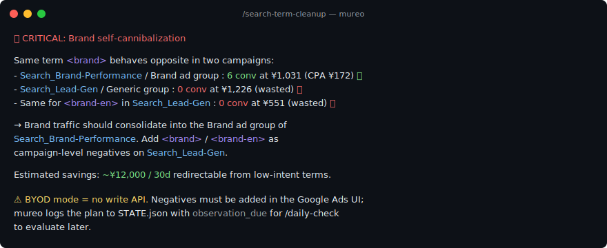
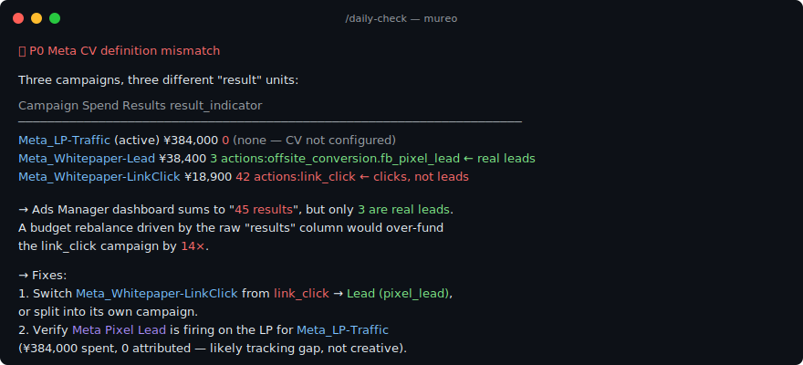

<p align="center">
  <picture>
    <source media="(prefers-color-scheme: dark)" srcset="docs/img/logo-dark.png">
    
  </picture>
</p>

<p align="center">
  <a href="https://mureo.io">Website</a> ·
  <a href="README.ja.md">日本語</a>
</p>

<p align="center">
  <a href="https://pypi.org/project/mureo/"></a>
  <a href="https://pypi.org/project/mureo/"></a>
  <a href="LICENSE"></a>
  <a href="https://github.com/logly/mureo/actions/workflows/ci.yml"></a>
</p>

**mureo** — your local-first AI ad ops crew. Find waste, audit changes, run ad accounts safely.

_Local-first. Strategy-grounded. Safety-gated._

Works with Claude Code, Cursor, Codex & Gemini. mureo sits on top of the official ad-platform MCPs and gives your AI a strategy to follow, an outcome to be measured against, and an audit trail you can show to anyone — **credentials never leave your machine**.

<p align="center">
  
</p>

<p align="center"><em>Real output: brand cannibalization auto-detected on a 30-day BYOD bundle (anonymized B2B SaaS account). <a href="#what-the-output-actually-looks-like-anonymized-b2b-saas-account">More samples ↓</a></em></p>

## What is mureo?

mureo is a **local-first control plane for AI ad ops**. Once installed, AI agents (Claude Code, Cursor, Codex, Gemini, etc.) operate Google Ads, Meta Ads, Search Console, and GA4 *through mureo* — which keeps every action grounded in your business strategy, tied to real outcomes, and recorded in an audit log you can replay.

When official ad-platform MCPs ship (Meta Ads MCP, Google Ads MCP, etc.), mureo uses them as drivers. mureo's value is not the API connection — it is **what happens around it**:

- **Strategy-grounded** — every decision reads `STRATEGY.md` (persona, USP, brand voice, goals)
- **Safety-gated** — rollback allow-list, GAQL guards, BYOD read-only by default, credential guard, per-platform throttle
- **Cross-platform** — Google Ads / Meta Ads / Search Console / GA4 in one workflow
- **Auditable** — append-only action log with rollback
- **Local-first** — credentials never leave your machine
- **Learnable** — `/learn` builds account-specific knowledge over time

> 🚧 **Coming v0.9 (Q3 2026)**: Outcome correlation — link platform metrics with your CRM / sales / LTV data, locally.

## Choose your setup

mureo has **3 modes** (where the data comes from) and runs across **3 hosts** (where the agent operates). Pick the cell, run the command:

| | Claude Code | Claude Desktop chat | Cowork (Desktop) |
|---|---|---|---|
| **Demo** (synthetic) | `mureo setup claude-code --skip-auth` + `mureo demo init --scenario seasonality-trap` | `mureo install-desktop --with-demo seasonality-trap` | Same as chat + connect the workspace folder |
| **BYOD** (your XLSX) | `mureo setup claude-code --skip-auth` + `mureo byod import bundle.xlsx` | `mureo install-desktop` + `mureo byod import bundle.xlsx` | Same as chat + connect the workspace folder |
| **Auth** (Live API) | `mureo setup claude-code` (interactive OAuth) | `mureo install-desktop` + `mureo auth setup --web` | Same as chat + connect the workspace folder |

Full per-row walkthroughs (including how to obtain your XLSX, where to put it, and how to import it): **[Getting Started →](docs/getting-started.md)**.

> **Not familiar with Google Cloud Console or Meta for Developers?** OAuth flows, developer-token registration, and Business-app sign-ups can feel intimidating if you have never used those consoles before. **Start with BYOD** — you will see what mureo can do for your account in a few minutes, then decide whether the Live API path is worth setting up.

## BYOD vs Live API at a glance

### Mode A: BYOD — 5 minutes to first diagnosis, no OAuth

**Drop a Sheet-bundle XLSX into mureo and get a strategy-grounded multi-platform diagnosis.** No OAuth flow, no developer-token approval, no SaaS sign-up.

```bash
pip install mureo
mureo setup claude-code --skip-auth
mureo byod import ~/Downloads/mureo-google-ads.xlsx
mureo byod import ~/Downloads/mureo-meta-ads.xlsx     # add Meta later — they're independent
# Open Claude Code and ask: "Run /daily-check"
```

Producing the XLSX is a one-time setup per platform:

- **Google Ads** — Apps Script template populates a Google Sheet you own; download as XLSX (~5 min). [See guide →](docs/byod.md#google-ads-setup)
- **Meta Ads** — Saved Report in Ads Manager → 2-click export. **Recognized in 9 languages** (English / 日本語 / 简体中文 / 繁體中文 / 한국어 / Español / Português / Deutsch / Français), so you do not need to switch Ads Manager UI to English. [See guide →](docs/byod.md#meta-ads-setup)

**Read-only by construction.** Every mutation tool (`/rescue`, `/budget-rebalance`, `/creative-refresh`) returns `{"status": "skipped_in_byod_readonly"}` — the agent analyzes and recommends but never writes to your real account. Upgrade a platform to the Live API later with `mureo byod remove --google-ads` (one platform) or `mureo byod clear` (all).

### Mode B: Live API OAuth — full functionality

Connect mureo directly to Google Ads / Meta Ads APIs. **Required to actually execute changes** (`/rescue`, `/budget-rebalance`, `/creative-refresh`, `mureo rollback apply`) and for GA4 / Search Console support.

```bash
pip install mureo
mureo auth setup           # browser-based OAuth wizard
mureo setup claude-code    # MCP + workflow commands
# Open Claude Code and ask: "Run /daily-check"
```

Prerequisites: Google Ads Developer Token + OAuth Client; Meta App ID + Secret. The wizard walks you through both — see [Authentication](#authentication) below.

### Which mode fits?

| Capability                                         | Mode A: BYOD                            | Mode B: Live API |
|----------------------------------------------------|-----------------------------------------|------------------|
| **First-time setup time**                          | **5–10 min per platform**               | 30–60 min |
| **Approval / waiting risk**                        | **None**                                | 1–3 weeks Google review, sometimes rejected |
| `/daily-check`, `/weekly-report`                   | ✅ (campaign / ad-set / ad drill-down + placement / platform / device breakdown) | ✅ |
| `/goal-review`, `/sync-state`                      | ✅                                      | ✅ |
| `/rescue` / `/budget-rebalance` (proposals)        | ✅                                      | ✅ |
| `/search-term-cleanup` (analysis)                  | ✅ Google Ads only                      | ✅ |
| `/search-term-cleanup` (execute)                   | 🛡️ Preview only                         | ✅ Live |
| `/rescue` / `/budget-rebalance` (execute)          | 🛡️ Preview only                         | ✅ Live |
| `/creative-refresh` (execute)                      | 🛡️ Preview only                         | ✅ Live |
| `/competitive-scan`                                | ⚠️ Google Ads BYOD has no auction insights (Ads Scripts limitation) | ✅ |
| GA4 / Search Console                               | ❌ (not in BYOD bundle)                 | ✅ |

**Recommended starting path:** Try Mode A on one platform first → run `/daily-check` → decide whether to add the second platform via BYOD or graduate to Mode B. The presence of `~/.mureo/byod/manifest.json` is the switch — no config flags, no global toggle.

See [docs/byod.md](docs/byod.md) for the full walkthrough, Saved Report config, and per-platform export instructions.


## Features

### Strategy-driven decisions

Every operation starts from `STRATEGY.md` -- your persona, USP, brand voice, goals, and operation mode. The agent doesn't just optimize metrics; it optimizes toward your business objectives.

```
/creative-refresh reads your Persona and USP before drafting a single headline.
/budget-rebalance checks your Operation Mode before shifting a single dollar.
/rescue cross-references your Goals before recommending what to fix first.
```

### Cross-platform analysis

mureo orchestrates across Google Ads, Meta Ads, Search Console, and GA4 in a single workflow:

- `/daily-check` -- pulls delivery status, ad performance, organic search trends, and site behavior across all platforms, then correlates them into one health report.
- `/search-term-cleanup` -- compares paid keywords against organic rankings to eliminate wasteful overlap.
- `/competitive-scan` -- combines auction insights with organic position data for a complete competitive picture.

The agent auto-discovers your configured platforms. Add Meta Ads later? Every command adapts automatically.

### Built-in marketing expertise

Campaign diagnostics that pinpoint *why* ads aren't delivering -- budget constraints, bidding misconfiguration, policy disapprovals, and more. Search term intent classification. Budget efficiency scoring. RSA ad validation and asset auditing. Landing page analysis. Device-level CPA gap detection. The kind of knowledge experienced ad operators carry in their heads -- built into every workflow.

### Learnable operational know-how

When you correct the agent or share an operational insight, `/learn` saves it to a persistent knowledge base. That knowledge is loaded at the start of every future session, so the agent doesn't repeat the same mistakes and applies what it learned to similar situations across your account.

```
You: "That's not a real CPA spike -- this industry always dips in Golden Week."
Agent: Saved. I'll flag this as seasonal next time.

→ Written to the diagnostic knowledge base.
→ Every future /daily-check and /rescue will factor this in.
```

### Security by design

Marketing accounts are a high-value target. mureo is built with defense-in-depth for AI-driven operations:

- **Credential guard** — `mureo setup claude-code` installs a PreToolUse hook that blocks AI agents from reading `~/.mureo/credentials.json`, `.env`, and similar secrets, so a prompt-injection payload cannot exfiltrate tokens via the file-system tools.
- **GAQL input validation** — every ID, date, date-range constant, and string literal that enters a Google Ads query flows through one whitelist-based surface (`mureo/google_ads/_gaql_validator.py`), and `BETWEEN` clauses pattern-match and revalidate their dates instead of passing raw caller input into GAQL.
- **Anomaly detection** — `mureo/analysis/anomaly_detector.py` compares current campaign metrics against a median-based baseline from the action log and emits prioritized alerts for zero spend, CPA spikes, and CTR drops, with sample-size gates that suppress single-day noise. Exposed to agents via the `analysis_anomalies_check` MCP tool; `state_file` is sandboxed inside the MCP server's CWD so a prompt-injected agent cannot redirect it at an attacker-crafted `STATE.json`.
- **Rollback with allow-list gating** — `mureo/rollback/` turns agent-authored `reversible_params` hints into concrete `RollbackPlan` records. Only operations on an explicit allow-list are planned; destructive verbs (`.delete`, `.remove`, `.transfer`) and unexpected parameter keys are refused, so a compromised agent cannot smuggle a privileged call through the rollback path. `mureo rollback list` / `show` let operators preview plans, and the `rollback_apply` MCP tool executes them by re-dispatching through the same handler used for forward actions so the reversal re-enters the full policy gate (auth, rate limit, validation). Apply requires `confirm=true` (literal boolean), refuses `rollback.*` self-recursion, records the reversal as an append-only `action_log` entry tagged with `rollback_of=<index>`, and refuses a second apply of the same index.
- **Immutable data models** — every state object (`StateDocument`, `ActionLogEntry`, `CampaignSnapshot`, `Anomaly`, `RollbackPlan`) is a `frozen=True` dataclass; an agent cannot silently mutate its own record of what happened.
- **Local-only credentials** — tokens are loaded from `~/.mureo/credentials.json` or environment variables and transmitted only to the official ad-platform APIs. mureo itself has no telemetry.

See [SECURITY.md](SECURITY.md) for the full threat model and vulnerability reporting process.

<details>
<summary>Full capability list</summary>

| Area | Capabilities |
|------|-------------|
| **Diagnostics** | Automatic root cause identification for delivery issues (budget, bidding, policy, structure), learning period detection, smart bidding classification, zero-conversion analysis |
| **Performance** | Period-over-period comparison, cost spike investigation, cross-campaign health checks, CPA/CV goal tracking |
| **Search terms** | N-gram distribution, intent pattern detection, add/exclude candidate scoring, paid vs organic overlap analysis |
| **Creative** | RSA validation (prohibited expressions, character width, ad strength prediction), asset-level performance audit, LP analysis, message match scoring |
| **Budget** | Cross-campaign allocation analysis, reallocation recommendations, efficiency scoring |
| **Competitive** | Auction insights, impression share trends, organic position correlation |
| **Meta Ads** | Placement analysis (Facebook/Instagram/Audience Network), cost investigation, A/B comparison, creative suggestions |
| **Monitoring** | Delivery goal evaluation, CPA/CV goal tracking, device analysis, B2B-specific checks |

</details>

## Workflow Commands

| Command | What it does |
|---------|-------------|
| `/onboard` | Discover your platforms, generate STRATEGY.md, initialize STATE.json |
| `/daily-check` | Cross-platform health monitoring + organic pulse + site behavior correlation |
| `/rescue` | Emergency performance fix: platform-side vs site-side root cause diagnosis |
| `/search-term-cleanup` | Keyword hygiene with paid/organic overlap elimination |
| `/creative-refresh` | Multi-platform ad copy refresh using your Persona, USP, and organic keyword data |
| `/budget-rebalance` | Cross-platform budget optimization informed by organic coverage |
| `/competitive-scan` | Paid + organic competitive landscape analysis |
| `/goal-review` | Multi-source goal progress evaluation with operation mode recommendations |
| `/weekly-report` | Cross-platform weekly operations summary |
| `/sync-state` | Refresh STATE.json from live platform data |
| `/learn` | Save a diagnostic insight to the knowledge base for future sessions |

### Getting started

```
pip install mureo
mureo setup claude-code

# Then in Claude Code:
/onboard          # First time: set up strategy + state
/daily-check      # Daily: check all campaigns
/rescue           # When performance drops
```

### Example: `/creative-refresh` in action

```
You: /creative-refresh

Agent reads STRATEGY.md:
  Persona: "Budget-constrained SaaS marketer"
  USP: "AI reduces ad ops workload by 10h/week"
  Brand Voice: "Data-driven, no hype"

Agent discovers platforms from STATE.json:
  → Google Ads + Meta Ads configured

Agent pulls data across platforms and data sources:
  → Creative audit         → 3 underperforming Google Ads assets
  → Landing page analysis  → LP highlights: free trial, ROI improvement
  → Search Console         → "ad automation" has strong organic clicks
  → GA4                    → high bounce rate on pricing page

Agent generates platform-appropriate copy from your strategy:
  Google Ads: "Cut Ad Ops Time by 60% with AI"  ← Persona pain point
  Google Ads: "Free Trial | Ad Automation"       ← LP + organic keyword
  Meta Ads:   "Stop drowning in ad reports..."   ← Brand Voice + social format

Agent validates, then asks for approval:
  "I suggest replacing 3 Google Ads headlines and 2 Meta ads. Here's why..."

You approve → Agent updates each platform.
```

### What the output actually looks like (anonymized B2B SaaS account)

Real diagnostic excerpts from a 30-day BYOD bundle on a Japanese B2B SaaS account. Campaign / ad-group names are anonymized and brand search terms replaced with `<brand>`. Numbers are unchanged so the math holds.

**`/search-term-cleanup` — brand cannibalization detected automatically**


Why this matters: numbers-only tools dedupe by recency. mureo reads STRATEGY.md, notices the two campaigns have *different intents* (brand vs generic lead-gen), and routes the term to where it converts — a **7× CPA gap** that nobody was acting on.

**`/daily-check` — Meta CV-definition mismatch caught at the source**



Why this matters: `link_click` vs `pixel_lead` optimization is a tracking distinction that doesn't show on a numbers-only dashboard. mureo surfaces `result_indicator` per campaign so the agent compares apples to apples *before* recommending a budget move.

### Analysis & domain knowledge (built-in)

<details>
<summary>Click to expand full capability list</summary>

**Campaign Diagnostics & Performance**

| Capability | Description |
|------------|-------------|
| Campaign diagnostics | Automatic root cause identification for delivery issues, learning period detection, smart bidding classification |
| Performance analysis | Period-over-period comparison, cost increase investigation, cross-campaign health checks |
| Search term analysis | N-gram distribution, intent pattern detection, automated add/exclude candidate scoring |
| Budget efficiency | Cross-campaign budget allocation analysis, reallocation recommendations |
| Device analysis | CPA gap detection, zero-conversion device identification |
| Auction insights | Competitive landscape analysis, impression share trends |
| B2B optimization | Industry-specific campaign checks and recommendations |

**Creative & Landing Page**

| Capability | Description |
|------------|-------------|
| RSA ad validation | Prohibited expression detection, character width calculation, auto-correction, ad strength prediction |
| RSA asset audit | Asset-level performance analysis, replacement/addition recommendations |
| Landing page analysis | HTML parsing with SSRF protection, CTA/feature/price detection, industry estimation |
| Creative research | Aggregates LP + existing ads + search terms + keyword suggestions into a unified research package |
| Message match evaluation | Ad copy <-> landing page alignment scoring (screenshot capture via Playwright) |

**Monitoring & Goals**

| Capability | Description |
|------------|-------------|
| Delivery goal evaluation | Campaign status + diagnostics + performance -> critical/warning/healthy classification |
| CPA goal tracking | Actual vs target CPA with trend analysis |
| CV goal tracking | Daily conversion volume monitoring against targets |
| Zero-conversion diagnosis | Root cause analysis for campaigns with no conversions |

**Meta Ads Analysis**

| Capability | Description |
|------------|-------------|
| Placement analysis | Performance breakdown by Facebook, Instagram, Audience Network |
| Cost investigation | CPA degradation root cause analysis |
| Ad comparison | A/B performance comparison within ad sets |
| Creative suggestions | Data-driven creative improvement recommendations |

</details>

## Quick Start

### Prerequisites

- **Google Ads** -- [Developer Token](https://developers.google.com/google-ads/api/docs/get-started/dev-token) and OAuth Client ID / Client Secret
- **Meta Ads** -- Create an app on [Meta for Developers](https://developers.facebook.com/) to obtain an App ID / App Secret (development mode is fine)

The `mureo auth setup` wizard walks you through both.

### Browser-based auth wizard (`mureo auth setup --web`)

Pasting long secrets into a terminal prompt is error-prone. After installation, `mureo auth setup --web` starts a short-lived local wizard on `http://127.0.0.1:<random-port>/` and opens your browser to a local form where you paste the Developer Token / App ID / App Secret (each field has a deep link to Google Cloud Console / Google Ads API Center / Meta for Developers). The OAuth flow completes in the same browser window and the wizard writes `~/.mureo/credentials.json` for you.

<details>
<summary>Why the wizard is safe to run locally</summary>

The wizard binds only to `127.0.0.1` on a random OS-assigned port. The form is CSRF-protected (token rotates after every successful submit); the OAuth `state` parameter is validated with `secrets.compare_digest` on callback; a `Host`-header allow-list blocks DNS-rebinding attacks; redirect URLs are pinned to `https://accounts.google.com/` and `https://www.facebook.com/` so the wizard cannot be tricked into an open-redirect; session secrets are zeroed in memory after credentials are persisted. POST bodies are capped at 16 KiB and the process shuts the server down once the `/done` page is served. All dependencies are stdlib — no external web framework to supply-chain-compromise.

</details>

### Claude Code (recommended)

```bash
pip install mureo
mureo setup claude-code
```

This single command handles everything:
1. Google Ads / Meta Ads authentication (OAuth)
2. MCP server configuration for Claude Code
3. Credential guard (blocks AI agents from reading secrets)
4. Workflow commands (`/daily-check`, `/rescue`, `/learn`, etc.)
5. Skills (tool references, strategy guide, evidence-based decisions, diagnostic knowledge)

After setup, run `/onboard` in Claude Code to get started.

### Cursor

```bash
pip install mureo
mureo setup cursor
```

Cursor supports MCP tools but does not support workflow commands or skills.

### Codex CLI

```bash
pip install mureo
mureo setup codex
```

Full parity with Claude Code: MCP server, credential guard (PreToolUse hook), workflow commands, and skills are all installed under `~/.codex/`. Workflow commands are installed as Codex skills at `~/.codex/skills/<command>/SKILL.md` (Codex CLI 0.117.0+ no longer surfaces `~/.codex/prompts/`, see [openai/codex#15941](https://github.com/openai/codex/issues/15941)); invoke them with `$daily-check` or the `/skills` picker.

### Gemini CLI

```bash
pip install mureo
mureo setup gemini
```

Registers mureo as a Gemini CLI extension at `~/.gemini/extensions/mureo/` with MCP server config and `CONTEXT.md` as the context file. Gemini CLI does not support PreToolUse hooks or the `.md` command format mureo bundles, so those layers are not installed.

### CLI only (authentication management)

```bash
pip install mureo
mureo auth setup
mureo auth status
```

### Docker

Run the mureo MCP server in an isolated container. Useful for:

- **Non–Claude Code MCP clients**: Cursor, Codex CLI, Gemini CLI, Continue, Cline, Zed, or any custom MCP client.
- **CI/CD pipelines**: scheduled anomaly checks, rollback dry-runs, weekly reports.
- **Multi-tenant / agency ops**: isolated credentials per client via separate containers.
- **MCP registry health checks** (Glama, etc.).

> Slash commands (`/daily-check`, `/rescue`) and the credential-guard hook are Claude Code–specific UX. For those, use `pip install mureo` with `mureo setup claude-code` instead.

#### Build and run

```bash
docker build -t mureo .
docker run --rm -v ~/.mureo:/home/mureo/.mureo mureo
```

Connect your MCP client by pointing its config at this `docker run` command.

#### Authentication

Credentials are loaded from `/home/mureo/.mureo/credentials.json` inside the container (via bind mount) or from environment variables. Three common patterns:

**1. Mounted credentials file** — if `~/.mureo/credentials.json` already exists on the host (from a prior `mureo auth setup`, a team-shared vault, or hand-crafted), the bind mount above is enough.

Schema for hand-crafting:

```json
{
  "google_ads": {
    "developer_token": "...",
    "client_id": "...apps.googleusercontent.com",
    "client_secret": "...",
    "refresh_token": "...",
    "login_customer_id": "1234567890"
  },
  "meta_ads": { "access_token": "..." }
}
```

Required: Google needs `developer_token` / `client_id` / `client_secret` / `refresh_token`. Meta needs `access_token`. Search Console reuses the Google OAuth credentials (OAuth app must include the `https://www.googleapis.com/auth/webmasters` scope).

**2. Environment variables** — useful for CI/CD where secrets come from a secret manager:

```bash
docker run --rm \
  -e GOOGLE_ADS_DEVELOPER_TOKEN=... \
  -e GOOGLE_ADS_CLIENT_ID=... \
  -e GOOGLE_ADS_CLIENT_SECRET=... \
  -e GOOGLE_ADS_REFRESH_TOKEN=... \
  -e GOOGLE_ADS_LOGIN_CUSTOMER_ID=... \
  -e META_ADS_ACCESS_TOKEN=... \
  mureo
```

Supported: `GOOGLE_ADS_{DEVELOPER_TOKEN, CLIENT_ID, CLIENT_SECRET, REFRESH_TOKEN, LOGIN_CUSTOMER_ID, CUSTOMER_ID}`, `META_ADS_{ACCESS_TOKEN, APP_ID, APP_SECRET, TOKEN_OBTAINED_AT, ACCOUNT_ID}`.

**3. Interactive wizard inside Docker** — if you don't have OAuth tokens yet and don't want to install mureo on the host:

```bash
docker run -it --rm -v ~/.mureo:/home/mureo/.mureo mureo mureo auth setup
```

Walks you through the OAuth flow in the terminal and writes `credentials.json` to the mounted volume. Subsequent runs pick it up automatically (pattern 1).

To obtain OAuth tokens outside mureo:

- Google Ads OAuth 2.0 refresh token: https://developers.google.com/google-ads/api/docs/oauth/overview
- Meta long-lived access token: https://developers.facebook.com/docs/facebook-login/guides/access-tokens/get-long-lived

### What gets installed

| Component | `mureo setup claude-code` | `mureo setup cursor` | `mureo setup codex` | `mureo setup gemini` | `mureo auth setup` |
|-----------|:---:|:---:|:---:|:---:|:---:|
| Authentication (~/.mureo/credentials.json) | Yes | Yes | Yes | Yes | Yes |
| MCP configuration | Yes | Yes | Yes | Yes | Yes |
| Credential guard (PreToolUse hook) | Yes | N/A | Yes | N/A | Yes |
| Workflow commands | Yes (~/.claude/commands/) | N/A | Yes (~/.codex/skills/ — invoke with `$cmd` or `/skills`) | N/A | No |
| Skills | Yes (~/.claude/skills/) | N/A | Yes (~/.codex/skills/) | N/A | No |
| Extension manifest (contextFileName) | N/A | N/A | N/A | Yes (~/.gemini/extensions/mureo/) | No |

### Skills reference

| Skill | Purpose |
|-------|---------|
| `_mureo-google-ads` | Google Ads tool reference (parameters, examples) |
| `_mureo-meta-ads` | Meta Ads tool reference (parameters, examples) |
| `_mureo-shared` | Authentication, security rules, output formatting |
| `_mureo-strategy` | STRATEGY.md / STATE.json format and usage guide |
| `_mureo-learning` | Evidence-based marketing decision framework (observation windows, sample sizes, noise guards) |
| `_mureo-pro-diagnosis` | Learnable diagnostic knowledge base (grows with use via `/learn`) |

### Connecting GA4 (Google Analytics 4)

mureo's workflow commands can leverage GA4 data (conversion rates, user behavior, landing page performance) when a GA4 MCP server is configured alongside mureo. GA4 data is optional — all commands work without it.

Setup using [Google Analytics MCP](https://github.com/googleanalytics/google-analytics-mcp):

1. Enable the required APIs in your GCP project:
   - [Google Analytics Admin API](https://console.cloud.google.com/apis/library/analyticsadmin.googleapis.com) -- click "Enable"
   - [Google Analytics Data API](https://console.cloud.google.com/apis/library/analyticsdata.googleapis.com) -- click "Enable"

2. Install and authenticate:

   ```bash
   pipx install analytics-mcp

   gcloud auth application-default login \
     --scopes https://www.googleapis.com/auth/analytics.readonly,https://www.googleapis.com/auth/cloud-platform
   ```

3. Add to `~/.claude/settings.json` alongside mureo:

   ```json
   {
     "mcpServers": {
       "mureo": {
         "command": "python",
         "args": ["-m", "mureo.mcp"]
       },
       "analytics-mcp": {
         "command": "pipx",
         "args": ["run", "analytics-mcp"],
         "env": {
           "GOOGLE_APPLICATION_CREDENTIALS": "/path/to/application_default_credentials.json",
           "GOOGLE_PROJECT_ID": "your-gcp-project-id"
         }
       }
     }
   }
   ```

### Connecting Other MCP Servers

mureo works alongside any MCP server in the same client session. Add them to your settings and workflow commands will incorporate their data when available. See [docs/integrations.md](docs/integrations.md) for details.

### Writing your own provider plugin

mureo's provider abstraction lets any pip-installable package add a new ad-platform provider (Microsoft/Bing Ads, Apple Search Ads, TikTok, LinkedIn, X, in-house platforms, ...) without touching mureo's source tree. A plugin is a Python package that implements one or more of the Phase 1 Protocols (`CampaignProvider`, `KeywordProvider`, `AudienceProvider`, `ExtensionProvider`), declares which `Capability` members it supports, and registers its class under the `mureo.providers` entry-points group in `pyproject.toml`. Plugins can also ship their own `SKILL.md` files via the `mureo.skills` group.

- [docs/plugin-authoring.md](docs/plugin-authoring.md) — full plugin authoring guide (quick start, Protocols, capabilities, models, skill matching, distribution patterns, security)
- [docs/ABI-stability.md](docs/ABI-stability.md) — ABI stability promise (what is breaking, what is not, deprecation policy)

## Authentication

### Interactive Setup (Recommended)

```bash
mureo auth setup
```

The setup wizard walks you through:

1. **Google Ads** -- Enter Developer Token + Client ID/Secret, open browser for OAuth, select a Google Ads customer account
2. **Meta Ads** -- Enter App ID/Secret, open browser for OAuth, obtain a Long-Lived Token, select an ad account. Your Meta App can stay in **Development Mode** -- no App Review is needed since mureo operates your own ad account. You may see a permission warning for `business_management` during OAuth; this is safe to accept and required for accessing pages managed through Business Portfolio.
3. **MCP config** -- Automatically writes `.mcp.json` (project-level) or `~/.claude/settings.json` (global) so Claude Code / Cursor can discover the server

Credentials are saved to `~/.mureo/credentials.json`. Search Console reuses the same Google OAuth2 credentials as Google Ads -- no additional authentication is required.

### credentials.json

```json
{
  "google_ads": {
    "developer_token": "YOUR_DEVELOPER_TOKEN",
    "client_id": "YOUR_CLIENT_ID",
    "client_secret": "YOUR_CLIENT_SECRET",
    "refresh_token": "YOUR_REFRESH_TOKEN",
    "login_customer_id": "1234567890"
  },
  "meta_ads": {
    "access_token": "YOUR_ACCESS_TOKEN",
    "app_id": "YOUR_APP_ID",
    "app_secret": "YOUR_APP_SECRET"
  }
}
```

### Environment variables (fallback)

| Platform   | Variable                          | Required |
|------------|-----------------------------------|----------|
| Google Ads | `GOOGLE_ADS_DEVELOPER_TOKEN`      | Yes      |
| Google Ads | `GOOGLE_ADS_CLIENT_ID`            | Yes      |
| Google Ads | `GOOGLE_ADS_CLIENT_SECRET`        | Yes      |
| Google Ads | `GOOGLE_ADS_REFRESH_TOKEN`        | Yes      |
| Google Ads | `GOOGLE_ADS_LOGIN_CUSTOMER_ID`    | No       |
| Meta Ads   | `META_ADS_ACCESS_TOKEN`           | Yes      |
| Meta Ads   | `META_ADS_APP_ID`                 | No       |
| Meta Ads   | `META_ADS_APP_SECRET`             | No       |

Verify your setup:

```bash
mureo auth status
mureo auth check-google
mureo auth check-meta
```

## MCP Server

### Setup with Claude Code

**Project-level** (recommended) -- add to `.mcp.json` in your project root:

```json
{
  "mcpServers": {
    "mureo": {
      "command": "python",
      "args": ["-m", "mureo.mcp"]
    }
  }
}
```

**Global** -- add to `~/.claude/settings.json`:

```json
{
  "mcpServers": {
    "mureo": {
      "command": "python",
      "args": ["-m", "mureo.mcp"]
    }
  }
}
```

> Tip: `mureo auth setup` can write this configuration automatically.

### Setup with Cursor

Add to `.cursor/mcp.json`:

```json
{
  "mcpServers": {
    "mureo": {
      "command": "python",
      "args": ["-m", "mureo.mcp"]
    }
  }
}
```

### Tool list

#### Google Ads

<details>
<summary>Click to expand Google Ads tools</summary>

**Campaigns**

| Tool | Description |
|------|-------------|
| `google_ads_campaigns_list` | List campaigns |
| `google_ads_campaigns_get` | Get campaign details |
| `google_ads_campaigns_create` | Create a campaign (search or display, via `channel_type`) |
| `google_ads_campaigns_update` | Update campaign settings |
| `google_ads_campaigns_update_status` | Change campaign status (ENABLED/PAUSED/REMOVED) |
| `google_ads_campaigns_diagnose` | Diagnose campaign delivery status |

**Ad Groups**

| Tool | Description |
|------|-------------|
| `google_ads_ad_groups_list` | List ad groups |
| `google_ads_ad_groups_create` | Create an ad group |
| `google_ads_ad_groups_update` | Update an ad group |

**Ads**

| Tool | Description |
|------|-------------|
| `google_ads_ads_list` | List ads |
| `google_ads_ads_create` | Create a responsive search ad (RSA) |
| `google_ads_ads_create_display` | Create a responsive display ad (RDA); image files are uploaded automatically |
| `google_ads_ads_update` | Update an ad |
| `google_ads_ads_update_status` | Change ad status |
| `google_ads_ads_policy_details` | Get ad policy approval details |

**Keywords (8)**

| Tool | Description |
|------|-------------|
| `google_ads_keywords_list` | List keywords |
| `google_ads_keywords_add` | Add keywords |
| `google_ads_keywords_remove` | Remove a keyword |
| `google_ads_keywords_suggest` | Get keyword suggestions (Keyword Planner) |
| `google_ads_keywords_diagnose` | Diagnose keyword quality scores |
| `google_ads_keywords_pause` | Pause a keyword |
| `google_ads_keywords_audit` | Audit keyword performance and quality |
| `google_ads_keywords_cross_adgroup_duplicates` | Find duplicate keywords across ad groups |

**Negative Keywords (5)**

| Tool | Description |
|------|-------------|
| `google_ads_negative_keywords_list` | List negative keywords |
| `google_ads_negative_keywords_add` | Add negative keywords to a campaign |
| `google_ads_negative_keywords_remove` | Remove a negative keyword |
| `google_ads_negative_keywords_add_to_ad_group` | Add negative keywords to an ad group |
| `google_ads_negative_keywords_suggest` | Suggest negative keywords based on search terms |

**Budget (3)**

| Tool | Description |
|------|-------------|
| `google_ads_budget_get` | Get campaign budget |
| `google_ads_budget_update` | Update budget |
| `google_ads_budget_create` | Create a new campaign budget |

**Accounts (1)**

| Tool | Description |
|------|-------------|
| `google_ads_accounts_list` | List accessible Google Ads accounts |

**Search Terms (2)**

| Tool | Description |
|------|-------------|
| `google_ads_search_terms_report` | Get search terms report |
| `google_ads_search_terms_analyze` | Analyze search terms with intent classification |

**Sitelinks (3)**

| Tool | Description |
|------|-------------|
| `google_ads_sitelinks_list` | List sitelink extensions |
| `google_ads_sitelinks_create` | Create a sitelink extension |
| `google_ads_sitelinks_remove` | Remove a sitelink extension |

**Callouts (3)**

| Tool | Description |
|------|-------------|
| `google_ads_callouts_list` | List callout extensions |
| `google_ads_callouts_create` | Create a callout extension |
| `google_ads_callouts_remove` | Remove a callout extension |

**Conversions (7)**

| Tool | Description |
|------|-------------|
| `google_ads_conversions_list` | List conversion actions |
| `google_ads_conversions_get` | Get conversion action details |
| `google_ads_conversions_performance` | Get conversion performance metrics |
| `google_ads_conversions_create` | Create a conversion action |
| `google_ads_conversions_update` | Update a conversion action |
| `google_ads_conversions_remove` | Remove a conversion action |
| `google_ads_conversions_tag` | Get conversion tracking tag snippet |

**Targeting (11)**

| Tool | Description |
|------|-------------|
| `google_ads_recommendations_list` | List optimization recommendations |
| `google_ads_recommendations_apply` | Apply an optimization recommendation |
| `google_ads_device_targeting_get` | Get device targeting settings |
| `google_ads_device_targeting_set` | Set device targeting bid adjustments |
| `google_ads_bid_adjustments_get` | Get bid adjustment settings |
| `google_ads_bid_adjustments_update` | Update bid adjustments |
| `google_ads_location_targeting_list` | List location targeting criteria |
| `google_ads_location_targeting_update` | Update location targeting |
| `google_ads_schedule_targeting_list` | List ad schedule targeting |
| `google_ads_schedule_targeting_update` | Update ad schedule targeting |
| `google_ads_change_history_list` | List account change history |

**Analysis (13)**

| Tool | Description |
|------|-------------|
| `google_ads_performance_report` | Get performance report |
| `google_ads_performance_analyze` | Analyze performance trends and anomalies |
| `google_ads_cost_increase_investigate` | Investigate sudden cost increases |
| `google_ads_health_check_all` | Run a comprehensive account health check |
| `google_ads_ad_performance_compare` | Compare ad performance across variants |
| `google_ads_ad_performance_report` | Get detailed ad-level performance report |
| `google_ads_network_performance_report` | Get network-level performance breakdown |
| `google_ads_budget_efficiency` | Analyze budget utilization efficiency |
| `google_ads_budget_reallocation` | Suggest budget reallocation across campaigns |
| `google_ads_auction_insights_get` | Get auction insights (competitor analysis) |
| `google_ads_rsa_assets_analyze` | Analyze RSA asset performance |
| `google_ads_rsa_assets_audit` | Audit RSA assets for best practices |
| `google_ads_search_terms_review` | Review search terms and suggest additions/exclusions |

**B2B (1)**

| Tool | Description |
|------|-------------|
| `google_ads_btob_optimizations` | Get B2B-specific optimization suggestions |

**Creative (2)**

| Tool | Description |
|------|-------------|
| `google_ads_landing_page_analyze` | Analyze landing page relevance and quality |
| `google_ads_creative_research` | Research competitive creative strategies |

**Monitoring (4)**

| Tool | Description |
|------|-------------|
| `google_ads_monitoring_delivery_goal` | Monitor campaign delivery against goals |
| `google_ads_monitoring_cpa_goal` | Monitor CPA against target goals |
| `google_ads_monitoring_cv_goal` | Monitor conversion volume against goals |
| `google_ads_monitoring_zero_conversions` | Detect campaigns with zero conversions |

**Capture (1)**

| Tool | Description |
|------|-------------|
| `google_ads_capture_screenshot` | Capture a screenshot of a URL |

**Device (1)**

| Tool | Description |
|------|-------------|
| `google_ads_device_analyze` | Analyze device-level performance |

**CPC (1)**

| Tool | Description |
|------|-------------|
| `google_ads_cpc_detect_trend` | Detect CPC trend (rising/stable/falling) |

**Assets (1)**

| Tool | Description |
|------|-------------|
| `google_ads_assets_upload_image` | Upload an image asset |

</details>

#### Meta Ads

<details>
<summary>Click to expand Meta Ads tools</summary>

**Campaigns (6)**

| Tool | Description |
|------|-------------|
| `meta_ads_campaigns_list` | List campaigns |
| `meta_ads_campaigns_get` | Get campaign details |
| `meta_ads_campaigns_create` | Create a campaign |
| `meta_ads_campaigns_update` | Update a campaign |
| `meta_ads_campaigns_pause` | Pause a campaign |
| `meta_ads_campaigns_enable` | Enable a paused campaign |

**Ad Sets (6)**

| Tool | Description |
|------|-------------|
| `meta_ads_ad_sets_list` | List ad sets |
| `meta_ads_ad_sets_create` | Create an ad set |
| `meta_ads_ad_sets_update` | Update an ad set |
| `meta_ads_ad_sets_get` | Get ad set details |
| `meta_ads_ad_sets_pause` | Pause an ad set |
| `meta_ads_ad_sets_enable` | Enable a paused ad set |

**Ads (6)**

| Tool | Description |
|------|-------------|
| `meta_ads_ads_list` | List ads |
| `meta_ads_ads_create` | Create an ad |
| `meta_ads_ads_update` | Update an ad |
| `meta_ads_ads_get` | Get ad details |
| `meta_ads_ads_pause` | Pause an ad |
| `meta_ads_ads_enable` | Enable a paused ad |

**Creatives (6)**

| Tool | Description |
|------|-------------|
| `meta_ads_creatives_create_carousel` | Create a carousel creative (2-10 cards) |
| `meta_ads_creatives_create_collection` | Create a collection creative |
| `meta_ads_creatives_list` | List ad creatives |
| `meta_ads_creatives_create` | Create a standard ad creative |
| `meta_ads_creatives_create_dynamic` | Create a dynamic product ad creative |
| `meta_ads_creatives_upload_image` | Upload an image for use in creatives |

**Images (1)**

| Tool | Description |
|------|-------------|
| `meta_ads_images_upload_file` | Upload an image from local file |

**Insights (2)**

| Tool | Description |
|------|-------------|
| `meta_ads_insights_report` | Get performance report |
| `meta_ads_insights_breakdown` | Get breakdown report (age, gender, placement, etc.) |

**Audiences (5)**

| Tool | Description |
|------|-------------|
| `meta_ads_audiences_list` | List custom audiences |
| `meta_ads_audiences_create` | Create a custom audience |
| `meta_ads_audiences_get` | Get audience details |
| `meta_ads_audiences_delete` | Delete a custom audience |
| `meta_ads_audiences_create_lookalike` | Create a lookalike audience |

**Conversions API (3)**

| Tool | Description |
|------|-------------|
| `meta_ads_conversions_send` | Send a conversion event (generic) |
| `meta_ads_conversions_send_purchase` | Send a purchase event |
| `meta_ads_conversions_send_lead` | Send a lead event |

**Pixels (4)**

| Tool | Description |
|------|-------------|
| `meta_ads_pixels_list` | List pixels |
| `meta_ads_pixels_get` | Get pixel details |
| `meta_ads_pixels_stats` | Get pixel firing statistics |
| `meta_ads_pixels_events` | List pixel events |

**Analysis (6)**

| Tool | Description |
|------|-------------|
| `meta_ads_analysis_performance` | Analyze overall performance trends |
| `meta_ads_analysis_audience` | Analyze audience performance and overlap |
| `meta_ads_analysis_placements` | Analyze placement performance breakdown |
| `meta_ads_analysis_cost` | Analyze cost trends and efficiency |
| `meta_ads_analysis_compare_ads` | Compare performance across ads |
| `meta_ads_analysis_suggest_creative` | Suggest creative improvements based on data |

**Product Catalog (11)**

| Tool | Description |
|------|-------------|
| `meta_ads_catalogs_list` | List product catalogs |
| `meta_ads_catalogs_create` | Create a product catalog |
| `meta_ads_catalogs_get` | Get catalog details |
| `meta_ads_catalogs_delete` | Delete a catalog |
| `meta_ads_products_list` | List products in a catalog |
| `meta_ads_products_add` | Add a product to a catalog |
| `meta_ads_products_get` | Get product details |
| `meta_ads_products_update` | Update a product |
| `meta_ads_products_delete` | Delete a product |
| `meta_ads_feeds_list` | List catalog feeds |
| `meta_ads_feeds_create` | Create a catalog feed (URL + scheduled import) |

**Lead Ads (5)**

| Tool | Description |
|------|-------------|
| `meta_ads_lead_forms_list` | List lead forms (per Page) |
| `meta_ads_lead_forms_get` | Get lead form details |
| `meta_ads_lead_forms_create` | Create a lead form |
| `meta_ads_leads_get` | Get leads (per form) |
| `meta_ads_leads_get_by_ad` | Get leads (per ad) |

**Videos (2)**

| Tool | Description |
|------|-------------|
| `meta_ads_videos_upload` | Upload a video from URL |
| `meta_ads_videos_upload_file` | Upload a video from local file |

**Split Tests (4)**

| Tool | Description |
|------|-------------|
| `meta_ads_split_tests_list` | List A/B tests |
| `meta_ads_split_tests_get` | Get A/B test details and results |
| `meta_ads_split_tests_create` | Create an A/B test |
| `meta_ads_split_tests_end` | End an A/B test |

**Ad Rules (5)**

| Tool | Description |
|------|-------------|
| `meta_ads_ad_rules_list` | List automated rules |
| `meta_ads_ad_rules_get` | Get automated rule details |
| `meta_ads_ad_rules_create` | Create an automated rule (CPA alerts, auto-pause, etc.) |
| `meta_ads_ad_rules_update` | Update an automated rule |
| `meta_ads_ad_rules_delete` | Delete an automated rule |

**Page Posts (2)**

| Tool | Description |
|------|-------------|
| `meta_ads_page_posts_list` | List Facebook Page posts |
| `meta_ads_page_posts_boost` | Boost a Page post |

**Instagram (3)**

| Tool | Description |
|------|-------------|
| `meta_ads_instagram_accounts` | List connected Instagram accounts |
| `meta_ads_instagram_media` | List Instagram posts |
| `meta_ads_instagram_boost` | Boost an Instagram post |

</details>

#### Search Console

<details>
<summary>Click to expand Search Console tools</summary>

**Sites (2)**

| Tool | Description |
|------|-------------|
| `search_console_sites_list` | List verified sites |
| `search_console_sites_get` | Get site details |

**Analytics (4)**

| Tool | Description |
|------|-------------|
| `search_console_analytics_query` | Query search analytics data |
| `search_console_analytics_top_queries` | Get top search queries |
| `search_console_analytics_top_pages` | Get top pages by clicks/impressions |
| `search_console_analytics_device_breakdown` | Get performance breakdown by device |
| `search_console_analytics_compare_periods` | Compare search performance across time periods |

**Sitemaps (2)**

| Tool | Description |
|------|-------------|
| `search_console_sitemaps_list` | List sitemaps for a site |
| `search_console_sitemaps_submit` | Submit a sitemap |

**URL Inspection (1)**

| Tool | Description |
|------|-------------|
| `search_console_url_inspection_inspect` | Inspect a URL for indexing status |

</details>

#### Rollback

<details>
<summary>Click to expand rollback tools</summary>

Cross-platform tools that inspect and apply the reversal plan for a previously-recorded `action_log` entry. Apply re-dispatches through the same MCP handler used for forward actions, so the reversal re-enters the full policy gate (auth, rate limit, input validation, allow-list).

| Tool | Description |
|------|-------------|
| `rollback_plan_get` | Inspect the reversal plan for an `action_log` entry (`supported` / `partial` / `not_supported`), its `operation` + `params`, and any caveats. Read-only; does not execute. |
| `rollback_apply` | Execute the reversal plan for `action_log[index]`. Requires `confirm=true` as a literal boolean. Appends a new log entry tagged `rollback_of=<index>`; a second apply of the same index is refused. `state_file` is resolved strictly inside the MCP server's CWD — path traversal, symlink escape, and `rollback.*` self-recursion are all refused. |

</details>

#### Analysis

<details>
<summary>Click to expand analysis tools</summary>

Cross-platform detection tools that operate on STATE.json's `action_log` history rather than on platform APIs directly.

| Tool | Description |
|------|-------------|
| `analysis_anomalies_check` | Compare a campaign's current metrics against a median-based baseline built from `action_log` history. Returns severity-ordered anomalies — zero spend (CRITICAL), CPA spike (HIGH/CRITICAL, gated by 30+ conversions), CTR drop (HIGH/CRITICAL, gated by 1000+ impressions). Sample-size gates follow the `_mureo-learning` skill's statistical-thinking rules. Returns `baseline=null` when history is shorter than `min_baseline_entries` (default 7); `baseline_warning` surfaces a parseable-but-corrupt `STATE.json` without silencing live zero-spend detection. |

</details>

## CLI

```bash
mureo setup claude-code    # One-command setup for Claude Code
mureo setup cursor         # Setup for Cursor
mureo auth status          # Check authentication status
mureo auth check-google    # Verify Google Ads credentials
mureo auth check-meta      # Verify Meta Ads credentials
```

## Strategy Context

Two local files drive strategy-aware operations. Run `/onboard` to generate them interactively.

- **STRATEGY.md** -- Persona, USP, Brand Voice, Goals, Operation Mode. See [docs/strategy-context.md](docs/strategy-context.md).
- **STATE.json** -- Campaign snapshots, action log. Updated automatically by workflow commands.

## Architecture

```
mureo/
├── __init__.py              # Package root
├── auth.py                  # Credential loading (~/.mureo/credentials.json + env vars + Meta token auto-refresh)
├── auth_setup.py            # Interactive setup wizard (OAuth + MCP config)
├── throttle.py              # Rate limiting (token bucket + rolling hourly cap)
├── _image_validation.py     # Image file validation utilities
├── google_ads/              # Google Ads API client (google-ads SDK wrapper)
│   ├── client.py            # GoogleAdsApiClient (8 Mixin: Ads, Keywords, Analysis, Creative, Diagnostics, Extensions, Media, Monitoring)
│   ├── mappers.py           # Response mapping to structured dicts
│   └── _*.py                # 8 Mixin modules (ads, keywords, analysis, extensions, diagnostics,
│                            #   creative, monitoring, media) + validators + classifiers
├── meta_ads/                # Meta Ads API client (15 Mixins, httpx-based)
│   ├── client.py            # MetaAdsApiClient (Campaigns, AdSets, Ads, Creatives, Audiences, Pixels,
│   │                        #   Insights, Analysis, Catalog, Conversions, Leads, PagePosts, Instagram,
│   │                        #   SplitTest, AdRules)
│   ├── mappers.py           # Response mapping to structured dicts
│   └── _*.py                # 15 Mixin modules (campaigns, ads, creatives, audiences, etc.)
├── search_console/          # Google Search Console API client (reuses Google OAuth2 credentials)
│   └── client.py            # SearchConsoleApiClient
├── analysis/                # Cross-platform analysis utilities
│   └── lp_analyzer.py       # Landing page analysis engine
├── context/                 # File-based context (STRATEGY.md, STATE.json)
│   ├── models.py            # Immutable dataclasses (StrategyEntry, StateDocument)
│   ├── strategy.py          # STRATEGY.md parser / renderer
│   ├── state.py             # STATE.json parser / renderer
│   └── errors.py            # Context-related errors
├── cli/                     # Typer CLI (setup + auth only)
│   ├── main.py              # Entry point (mureo command)
│   ├── setup_cmd.py         # mureo setup claude-code / cursor
│   └── auth_cmd.py          # mureo auth setup / status / check-*
└── mcp/                     # MCP server
    ├── __main__.py                        # python -m mureo.mcp entry point
    ├── server.py                          # MCP server setup (stdio transport)
    ├── _helpers.py                        # Shared handler utilities
    ├── tools_google_ads.py                # Google Ads tool definitions (aggregator)
    ├── _tools_google_ads_*.py             # Tool definition sub-modules
    ├── _handlers_google_ads.py            # Google Ads base handlers
    ├── _handlers_google_ads_extensions.py # Extensions handlers
    ├── _handlers_google_ads_analysis.py   # Analysis handlers
    ├── tools_meta_ads.py                  # Meta Ads tool definitions (aggregator)
    ├── _tools_meta_ads_*.py               # Tool definition sub-modules
    ├── _handlers_meta_ads.py              # Meta Ads base handlers
    ├── _handlers_meta_ads_extended.py     # Extended handlers
    ├── _handlers_meta_ads_other.py        # Other handlers
    ├── tools_search_console.py            # Search Console tool definitions
    └── _handlers_search_console.py        # Search Console handlers
```

**Design principles:**

- **No database** -- all state is either in the ad platform APIs or in local files (`STRATEGY.md`, `STATE.json`).
- **No LLM dependency** -- mureo does not embed an LLM. Inference, planning, and decision-making are the agent's responsibility.
- **Immutable data models** -- all dataclasses use `frozen=True` to prevent accidental mutation.
- **Credentials stay local** -- loaded from `~/.mureo/credentials.json` or environment variables. Never sent anywhere except the official ad platform APIs.

## Development

```bash
git clone https://github.com/logly/mureo.git && cd mureo
pip install -e ".[dev]"
pytest tests/ -v                              # run tests
pytest --cov=mureo --cov-report=term-missing  # with coverage
ruff check mureo/ && black mureo/ && mypy mureo/  # lint & format
```

Python 3.10+ required. See [CONTRIBUTING.md](CONTRIBUTING.md) for full development guidelines.

## License

Apache License 2.0
