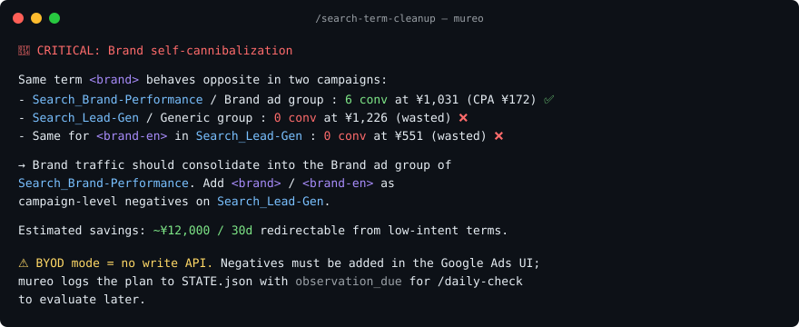
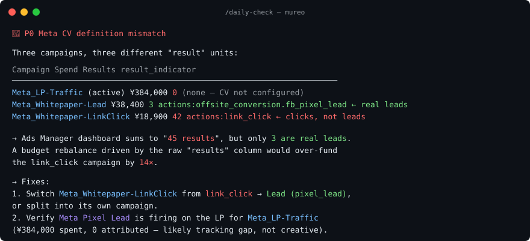

<p align="center">
  <picture>
    <source media="(prefers-color-scheme: dark)" srcset="docs/img/logo-dark.png">
    
  </picture>
</p>

<p align="center">
  <a href="https://mureo.io">Website</a> ·
  <a href="https://mureo.jp">Commercial edition</a> ·
  <a href="README.ja.md">日本語</a>
</p>

<p align="center">
  <a href="https://pypi.org/project/mureo/"></a>
  <a href="https://pypi.org/project/mureo/"></a>
  <a href="LICENSE"></a>
  <a href="https://github.com/logly/mureo/actions/workflows/ci.yml"></a>
</p>

**mureo** — your open-source, local-first AI ad ops crew. Find waste, audit changes, run ad accounts safely.

_Local-first. Strategy-grounded. Safety-gated._

Works with Claude Code, Cursor, Codex & Gemini. mureo sits on top of the official ad-platform [MCPs](https://modelcontextprotocol.io/) and gives your AI a strategy to follow, an outcome to be measured against, and an audit trail you can show to anyone — **credentials never leave your machine**.

> Commercial editions are also available — including a cloud-hosted service and a local Agency edition for teams and agencies. See **[mureo.jp](https://mureo.jp)**.

<p align="center">
  
</p>

<p align="center"><em>Real output: brand cannibalization auto-detected on a 30-day BYOD bundle (anonymized B2B SaaS account). <a href="#what-the-output-actually-looks-like-anonymized-b2b-saas-account">More samples ↓</a></em></p>

## What is mureo?

mureo is a **local-first control plane for AI ad ops**. Once installed, AI agents (Claude Code, Cursor, Codex, Gemini, etc.) operate Google Ads, Meta Ads, Amazon Ads, TikTok Ads, Search Console, and GA4 *through mureo* — which keeps every action grounded in your business strategy, tied to real outcomes, and recorded in an audit log you can replay.

mureo ships its own connectors for Google Ads, Meta Ads, and Search Console today, and plugs in official ad-platform MCPs as platforms release them (TikTok's is already supported, and **Amazon Ads (official MCP bridge)** is bridged through mureo so your credentials never enter the host's MCP config — see [docs/amazon-ads.md](docs/amazon-ads.md)). mureo's value is not the API connection — it is **what happens around it**:

- **Strategy-grounded** — every decision reads `STRATEGY.md` (persona, USP, brand voice, goals)
- **Safety-gated** — rollback allow-list, GAQL guards, BYOD read-only by default, credential guard, per-platform throttle
- **Cross-platform** — Google Ads / Meta Ads / Amazon Ads / TikTok Ads / Search Console / GA4 in one workflow
- **Auditable** — append-only action log with rollback
- **Local-first** — credentials never leave your machine
- **Learnable** — `/learn` builds account-specific knowledge over time

## Quick start — see it work in 2 minutes

All you need is Python 3.10+ and [Claude Code](https://claude.com/claude-code) (Cursor, Codex CLI, and Gemini CLI work too — see [Other agents and hosts](#other-agents-and-hosts)). The **demo scenario** runs on synthetic data, so it needs no ad-account credentials, no OAuth, and no sign-up:

```bash
pip install mureo
mureo configure
```

`mureo configure` opens a local browser UI (bound to `127.0.0.1`, no remote access). Pick your Claude app, run the one-click basic setup, and then choose a **demo scenario** in the Demo / BYOD section. The UI also offers a platform-connection (OAuth) step — **skip it for now**; the demo doesn't need it. (Terminal equivalent: `mureo setup claude-code --skip-auth && mureo demo init --scenario seasonality-trap`.)

Then open the generated demo directory (the UI shows its path) in Claude Code and ask:

```
/daily-check
```

You'll watch the agent read the demo `STRATEGY.md`, pull campaign data, and walk into a seasonality trap that numbers-only tools miss. Try `/search-term-cleanup` next.

When you're ready to point mureo at *your* data, pick one of the two paths below.

### Path A: Bring your own data (BYOD) — 5–10 min, no OAuth

**Export your real account data as an XLSX, drop it into mureo, and get a strategy-grounded multi-platform diagnosis** — no OAuth flow, no developer-token approval. Import the bundle from the `mureo configure` dashboard (the same Demo / BYOD section), or from the terminal:

```bash
mureo byod import ~/Downloads/mureo-google-ads.xlsx
mureo byod import ~/Downloads/mureo-meta-ads.xlsx   # platforms are independent — add either, or both
# Open Claude Code, run /onboard once, then: "Run /daily-check"
```

The first `/onboard` run interviews you and generates `STRATEGY.md` (your strategy) and `STATE.json` (state) — the context every later command reads. The demo skips this step because it ships with a ready-made `STRATEGY.md`.

Producing the XLSX is a one-time setup per platform — Google Ads via an Apps Script template (~5 min), Meta Ads via a 2-click Saved Report export (recognized in 9 languages). **[BYOD guide →](docs/byod.md)**

BYOD is **read-only by construction**: every mutation tool returns `{"status": "skipped_in_byod_readonly"}` — the agent analyzes and recommends but never writes to your account.

### Path B: Go live (OAuth) — full functionality

Connect mureo directly to the Google Ads / Meta Ads APIs. Required to actually execute changes (running `/rescue`, `/budget-rebalance`, `/creative-refresh`, or applying a rollback via the `rollback_apply` tool) and for GA4 / Search Console support.

In the same `mureo configure` UI, open **Connect platforms**: interactive Google / Meta OAuth in the browser, with each field deep-linking to the right console page, plus official-MCP provider registration. (Terminal equivalent: `mureo auth setup`.) **[Authentication guide →](docs/authentication.md)**

Prerequisites: a Google Ads Developer Token + OAuth Client, and/or a Meta App ID + Secret (development mode is fine). Both wizards walk you through obtaining them.

Once connected, open your working directory in Claude Code and run `/onboard` once — it generates `STRATEGY.md` and `STATE.json`, and commands become strategy-grounded only after those exist.

> **Not familiar with Google Cloud Console or Meta for Developers?** OAuth flows and developer-token registration can feel intimidating. **Start with the demo or BYOD** — see what mureo can do in minutes, then decide whether the Live API path is worth setting up.

### Which mode fits?

| Capability                                         | BYOD                                    | Live API |
|----------------------------------------------------|-----------------------------------------|------------------|
| **First-time setup time**                          | **5–10 min per platform**               | 30–60 min |
| **Approval / waiting risk**                        | **None**                                | 1–3 weeks Google review, sometimes rejected |
| `/daily-check`, `/weekly-report`                   | ✅ (campaign / ad-set / ad drill-down + placement / platform / device breakdown) | ✅ |
| `/goal-review`, `/sync-state`                      | ✅                                      | ✅ |
| `/rescue` / `/budget-rebalance` (proposals)        | ✅                                      | ✅ |
| `/search-term-cleanup` (analysis)                  | ✅ Google Ads only                      | ✅ |
| Execution (`/rescue`, `/budget-rebalance`, `/creative-refresh`, `/search-term-cleanup`) | 🛡️ Preview only | ✅ Live |
| `/competitive-scan`                                | ⚠️ Google Ads BYOD has no auction insights (Ads Scripts limitation) | ✅ |
| GA4 / Search Console                               | ❌ (not in BYOD bundle)                 | ✅ |

The presence of `~/.mureo/byod/manifest.json` is the switch — imported platforms run on BYOD, the rest on the Live API. Upgrade a platform any time with `mureo byod remove --google-ads` or `mureo byod clear`.

### Other agents and hosts

`mureo configure` covers the Claude hosts (Claude Code / Claude Desktop) end to end. The commands below are the scriptable equivalents, plus the non-Claude hosts:

| Host | Command | Notes |
|------|---------|-------|
| Claude Code | `mureo setup claude-code` | MCP server + credential guard + workflow skills |
| Claude Desktop (Chat / Cowork) | `mureo install-desktop` | Then connect the workspace folder in Cowork |
| Cursor | `mureo setup cursor` | MCP tools only (no workflow skills) |
| Codex CLI | `mureo setup codex` | Full parity — skills land in `~/.codex/skills/`, invoke with `$daily-check` |
| Gemini CLI | `mureo setup gemini` | Extension manifest; no PreToolUse hooks |
| Any MCP client / CI | Docker | **[Docker guide →](docs/docker.md)** |

Full per-host walkthroughs, including the Demo / BYOD / Live matrix for each: **[Getting Started →](docs/getting-started.md)**

## Features

### Strategy-driven decisions

Every operation starts from `STRATEGY.md` -- your persona, USP, brand voice, goals, and operation mode. The agent doesn't just optimize metrics; it optimizes toward your business objectives.

```
/creative-refresh reads your Persona and USP before drafting a single headline.
/budget-rebalance checks your Operation Mode before shifting a single dollar.
/rescue cross-references your Goals before recommending what to fix first.
```

### Cross-platform analysis

mureo orchestrates across Google Ads, Meta Ads, Amazon Ads, TikTok Ads, Search Console, and GA4 in a single workflow:

- `/daily-check` -- pulls delivery status, ad performance, organic search trends, and site behavior across all platforms, then correlates them into one health report.
- `/search-term-cleanup` -- compares paid keywords against organic rankings to eliminate wasteful overlap.
- `/competitive-scan` -- combines auction insights with organic position data for a complete competitive picture.

The agent auto-discovers your configured platforms. Add Meta Ads, Amazon Ads, or TikTok Ads later? Every command adapts automatically.

### Built-in marketing expertise

Campaign diagnostics that pinpoint *why* ads aren't delivering -- budget constraints, bidding misconfiguration, policy disapprovals, and more. Search term intent classification. Budget efficiency scoring. RSA ad validation and asset auditing. Landing page analysis. Device-level CPA gap detection. The kind of knowledge experienced ad operators carry in their heads -- built into every workflow.

### Creator-quality creative generation

`/creative-generate` produces creator-quality ad creatives — text-free key visuals from a bring-your-own-key image provider, then pixel-perfect Japanese typography composited via HTML/CSS + headless Chromium — and the agent scores every candidate before anything ships. See [docs/creative-studio.md](docs/creative-studio.md).

### Learnable operational know-how

When you correct the agent or share an operational insight, `/learn` saves it to a persistent knowledge base. That knowledge is loaded at the start of every future session, so the agent doesn't repeat the same mistakes and applies what it learned to similar situations across your account.

```
You: /learn That's not a real CPA spike -- this industry always dips in Golden Week.
Agent: Saved. I'll flag this as seasonal next time.

→ Written to the diagnostic knowledge base.
→ Every future /daily-check and /rescue will factor this in.
```

Beyond your own `/learn` history, mureo can also consult **external advisor MCP servers** — consulting firms, industry trade groups, OSS communities, or internal team wikis can stand up a vector-search MCP server that holds practitioner know-how (platform quirks, industry CPA / CTR benchmarks, post-cutoff platform updates) the LLM does not carry. Configure them in `~/.mureo/insight_sources.json` and the agent calls `mureo_consult_advisor` from any diagnostic skill to pull the matching fragments. The advisor keeps the corpus; mureo passes a context-rich query and receives only the top-k snippets. See [`docs/insight-federation.md`](docs/insight-federation.md) for the operator setup and the server-author spec.

### Security by design

Marketing accounts are a high-value target. mureo is built with defense-in-depth for AI-driven operations:

- **Credential guard** — `mureo setup claude-code` installs a PreToolUse hook that blocks AI agents from reading `~/.mureo/credentials.json`, `.env`, and similar secrets, so a prompt-injection payload cannot exfiltrate tokens via the file-system tools.
- **GAQL input validation** — every ID, date, date-range constant, and string literal that enters a Google Ads query flows through one whitelist-based surface (`mureo/google_ads/_gaql_validator.py`), and `BETWEEN` clauses pattern-match and revalidate their dates instead of passing raw caller input into GAQL.
- **Anomaly detection** — `mureo/analysis/anomaly_detector.py` compares current campaign metrics against a median-based baseline from the action log and emits prioritized alerts for zero spend, CPA spikes, and CTR drops, with sample-size gates that suppress single-day noise. Exposed to agents via the `analysis_anomalies_check` MCP tool; `state_file` is sandboxed inside the MCP server's CWD so a prompt-injected agent cannot redirect it at an attacker-crafted `STATE.json`.
- **Rollback with allow-list gating** — `mureo/rollback/` turns agent-authored `reversible_params` hints into concrete `RollbackPlan` records. Only operations on an explicit allow-list are planned; destructive verbs (`.delete`, `.remove`, `.transfer`) and unexpected parameter keys are refused, so a compromised agent cannot smuggle a privileged call through the rollback path. `mureo rollback list` / `show` let operators preview plans, and the `rollback_apply` MCP tool executes them by re-dispatching through the same handler used for forward actions so the reversal re-enters the full policy gate (auth, rate limit, validation). Apply requires `confirm=true` (literal boolean), refuses `rollback.*` self-recursion, records the reversal as an append-only `action_log` entry tagged with `rollback_of=<index>`, and refuses a second apply of the same index.
- **Immutable data models** — every state object (`StateDocument`, `ActionLogEntry`, `CampaignSnapshot`, `Anomaly`, `RollbackPlan`) is a `frozen=True` dataclass; an agent cannot silently mutate its own record of what happened.
- **Local-only credentials** — tokens are loaded from `~/.mureo/credentials.json` or environment variables and transmitted only to the official ad-platform APIs. mureo itself has no telemetry.

See [SECURITY.md](SECURITY.md) for the full threat model and vulnerability reporting process.

## Workflow Commands

| Command | What it does |
|---------|-------------|
| `/onboard` | Discover your platforms, generate STRATEGY.md, initialize STATE.json |
| `/daily-check` | Cross-platform health monitoring + organic pulse + site behavior correlation |
| `/tracking-health` | Preventive conversion-tracking audit (Meta pixels + CAPI, Google Ads conversion actions) with GA4 cross-check — scorecard + fix list ranked by revenue risk |
| `/rescue` | Emergency performance fix: platform-side vs site-side root cause diagnosis |
| `/incident-postmortem` | Post-incident retrospective: timeline reconstruction, root-cause analysis, reusable insights via `/learn`, and preventive guardrails (no ad-platform writes) |
| `/search-term-cleanup` | Keyword hygiene with paid/organic overlap elimination |
| `/creative-refresh` | Multi-platform ad copy refresh using your Persona, USP, and organic keyword data |
| `/creative-generate` | Generate creator-quality ad creatives (key visuals + composed banners) from a strategy brief, with an art-direction scoring loop ([Creative Studio](docs/creative-studio.md)) |
| `/ad-fatigue-check` | Detect creative fatigue (frequency, week-over-week CTR decline, CPM drift), score ads FATIGUED/WATCH/FRESH, and route refreshes to `/creative-generate` or `/creative-refresh` |
| `/experiment` | Design, run, and evaluate a controlled A/B split test — one variable, a falsifiable hypothesis, a fixed window, and a per-variant winner/no-difference/inconclusive verdict |
| `/lead-form-create` | One-question-at-a-time interview that builds a Meta Instant Form (Lead Ad form) and surfaces the cover-image step explicitly |
| `/budget-rebalance` | Cross-platform budget optimization informed by organic coverage |
| `/budget-pacing` | Month-to-date spend vs monthly target, landing forecast, and pace alerts (total-spend trajectory; pairs with `/budget-rebalance`) |
| `/competitive-scan` | Paid + organic competitive landscape analysis |
| `/audience-review` | Targeting & placement audit against your Persona — exclusions, bid adjustments, lookalikes, and placement pruning |
| `/goal-review` | Multi-source goal progress evaluation with operation mode recommendations |
| `/weekly-report` | Cross-platform weekly operations summary |
| `/monthly-report` | Client-facing monthly digest: month-over-month comparison, goal attainment, action recap, budget utilization |
| `/sync-state` | Refresh STATE.json from live platform data |
| `/learn` | Save a diagnostic insight to the knowledge base for future sessions |

### Example: `/creative-refresh` in action

```
You: /creative-refresh

Agent reads STRATEGY.md:
  Persona: "Budget-constrained SaaS marketer"
  USP: "AI reduces ad ops workload by 10h/week"
  Brand Voice: "Data-driven, no hype"

Agent discovers platforms from STATE.json:
  → Google Ads + Meta Ads configured

Agent pulls data across platforms and data sources:
  → Creative audit         → 3 underperforming Google Ads assets
  → Landing page analysis  → LP highlights: free trial, ROI improvement
  → Search Console         → "ad automation" has strong organic clicks
  → GA4                    → high bounce rate on pricing page

Agent generates platform-appropriate copy from your strategy:
  Google Ads: "Cut Ad Ops Time by 60% with AI"  ← Persona pain point
  Google Ads: "Free Trial | Ad Automation"       ← LP + organic keyword
  Meta Ads:   "Stop drowning in ad reports..."   ← Brand Voice + social format

Agent validates, then asks for approval:
  "I suggest replacing 3 Google Ads headlines and 2 Meta ads. Here's why..."

You approve → Agent updates each platform.
```

### What the output actually looks like (anonymized B2B SaaS account)

Real diagnostic excerpts from a 30-day BYOD bundle on a Japanese B2B SaaS account. Campaign / ad-group names are anonymized and brand search terms replaced with `<brand>`. Numbers are unchanged so the math holds.

**`/search-term-cleanup` — brand cannibalization detected automatically**


Why this matters: numbers-only tools dedupe by recency. mureo reads STRATEGY.md, notices the two campaigns have *different intents* (brand vs generic lead-gen), and routes the term to where it converts — a **7× CPA gap** that nobody was acting on.

**`/daily-check` — Meta CV-definition mismatch caught at the source**



Why this matters: `link_click` vs `pixel_lead` optimization is a tracking distinction that doesn't show on a numbers-only dashboard. mureo surfaces `result_indicator` per campaign so the agent compares apples to apples *before* recommending a budget move.

### Analysis & domain knowledge (built-in)

<details>
<summary>Click to expand full capability list</summary>

**Campaign Diagnostics & Performance**

| Capability | Description |
|------------|-------------|
| Campaign diagnostics | Automatic root cause identification for delivery issues, learning period detection, smart bidding classification |
| Performance analysis | Period-over-period comparison, cost increase investigation, cross-campaign health checks |
| Search term analysis | N-gram distribution, intent pattern detection, automated add/exclude candidate scoring |
| Budget efficiency | Cross-campaign budget allocation analysis, reallocation recommendations |
| Device analysis | CPA gap detection, zero-conversion device identification |
| Auction insights | Competitive landscape analysis, impression share trends |
| B2B optimization | Industry-specific campaign checks and recommendations |

**Creative & Landing Page**

| Capability | Description |
|------------|-------------|
| RSA ad validation | Prohibited expression detection, character width calculation, auto-correction, ad strength prediction |
| RSA asset audit | Asset-level performance analysis, replacement/addition recommendations |
| Landing page analysis | HTML parsing with SSRF protection, CTA/feature/price detection, industry estimation |
| Creative research | Aggregates LP + existing ads + search terms + keyword suggestions into a unified research package |
| Message match evaluation | Ad copy <-> landing page alignment scoring (screenshot capture via Playwright) |

**Monitoring & Goals**

| Capability | Description |
|------------|-------------|
| Delivery goal evaluation | Campaign status + diagnostics + performance -> critical/warning/healthy classification |
| CPA goal tracking | Actual vs target CPA with trend analysis |
| CV goal tracking | Daily conversion volume monitoring against targets |
| Zero-conversion diagnosis | Root cause analysis for campaigns with no conversions |

**Meta Ads Analysis**

| Capability | Description |
|------------|-------------|
| Placement analysis | Performance breakdown by Facebook, Instagram, Audience Network |
| Cost investigation | CPA degradation root cause analysis |
| Ad comparison | A/B performance comparison within ad sets |
| Creative suggestions | Data-driven creative improvement recommendations |

</details>

## Reference

### MCP server & tool list

mureo exposes **211 MCP tools** over stdio: Google Ads (89), Meta Ads (90), Search Console (10), plus rollback, anomaly detection, strategy/state context, analytics registry, learning, learning-period reset pre-flight, and Creative Studio. When Amazon Ads is configured, the bridged Amazon tools are added on top from the local manifest (their names and count are Amazon's, not mureo's — see [docs/amazon-ads.md](docs/amazon-ads.md)). Any MCP-compatible client can connect:

```json
{
  "mcpServers": {
    "mureo": {
      "command": "python",
      "args": ["-m", "mureo.mcp"]
    }
  }
}
```

Full tool list and client configuration: **[MCP Server Guide →](docs/mcp-server.md)**

### Authentication

`mureo configure` (browser) or `mureo auth setup` (terminal) walk you through Google Ads and Meta Ads credentials; both write `~/.mureo/credentials.json`. Environment variables work as a fallback for CI. Search Console reuses the Google OAuth credentials. Amazon Ads credentials go in the **Amazon Ads** card of the configure dashboard's *Plugin credentials* section — enter the Login with Amazon client id/secret, then run the card's **Authorize with Amazon** flow (Amazon has no loopback callback, so it is a guided paste-code flow: mureo opens Amazon's consent page and you paste the redirected address back) — or via the `AMAZON_ADS_*` environment variables. Verify any time:

```bash
mureo auth status
mureo auth check-google
mureo auth check-meta
```

Full schema, environment-variable reference, and per-host setup: **[Authentication Guide →](docs/authentication.md)**

### Strategy context

Two local files drive strategy-aware operations. Run `/onboard` to generate them interactively.

- **STRATEGY.md** -- Persona, USP, Brand Voice, Goals, Operation Mode. See [docs/strategy-context.md](docs/strategy-context.md).
- **STATE.json** -- Campaign snapshots, action log. Updated automatically by workflow commands.

### Connecting Amazon Ads, TikTok Ads, GA4, and other MCP servers

**Amazon Ads** is supported through the official Amazon Ads MCP, **bridged by mureo** rather than registered with your AI host: `Claude → local mureo MCP → Amazon's hosted MCP endpoint`. Your Login with Amazon credentials live in the `amazon_ads` section of `~/.mureo/credentials.json` (entered in the **Amazon Ads** card of `mureo configure`, or via `AMAZON_ADS_*` env vars) and never enter the host's MCP config; mureo mints and auto-refreshes the short-lived access token for you. Run `mureo amazon refresh-manifest` once to build the local tool manifest, then restart the MCP server — Amazon's own tools (`campaign_management-*`, `account_management-*`) appear and are audited, throttled, and strategy-gated like the built-in platforms, with mutations recorded in `action_log` under `platform=plugin:mureo-amazon-ads-bridge`. mureo's deep per-platform analytics (anomaly baselines, RSA audit) are not available for Amazon yet, so treat Amazon findings as advisory. **[Amazon Ads guide →](docs/amazon-ads.md)**

**TikTok Ads** is supported through TikTok's official hosted MCP (the "TikTok for Business MCP Server"). mureo ships it as the `tiktok-ads-official` provider — add it from the `mureo configure` dashboard or with `mureo providers add`, then authenticate in the browser with your TikTok for Business account on first connect (no developer token required). Once connected, workflow commands treat `tiktok_ads` as a first-class platform: `/daily-check` and the reports include it, and confirmed changes are recorded in the action log. mureo-native analytics (anomaly baselines, RSA audit) remain Google / Meta specific.

mureo's workflow commands leverage GA4 data (conversion rates, user behavior, landing page performance) when a GA4 MCP server — e.g. [Google Analytics MCP](https://github.com/googleanalytics/google-analytics-mcp) — is configured alongside mureo. GA4 is optional; all commands work without it. mureo also works alongside any other MCP server in the same session, and workflow commands incorporate their data when available. Setup walkthroughs: **[Integrations Guide →](docs/integrations.md)**

### Writing your own provider plugin

Any pip-installable package can add a new ad-platform provider (Microsoft/Bing Ads, Apple Search Ads, TikTok, LinkedIn, in-house platforms, ...) without touching mureo's source tree — implement the provider Protocols, declare capabilities, and register under the `mureo.providers` entry-point group. Plugins can also ship their own skills and analytics modules.

- [docs/plugin-authoring.md](docs/plugin-authoring.md) — full plugin authoring guide
- [docs/ABI-stability.md](docs/ABI-stability.md) — ABI stability promise and deprecation policy

### Architecture

- **No database** -- all state is either in the ad platform APIs or in local files (`STRATEGY.md`, `STATE.json`).
- **No LLM dependency** -- mureo does not embed an LLM. Inference, planning, and decision-making are the agent's responsibility.
- **No web framework** -- CLI (Typer) and MCP (stdio) only; the `mureo configure` UI is stdlib `http.server` on `127.0.0.1`.
- **Immutable data models** -- all dataclasses use `frozen=True` to prevent accidental mutation.
- **Credentials stay local** -- loaded from `~/.mureo/credentials.json` or environment variables. Never sent anywhere except the official ad platform APIs.

Module layout and system diagrams: **[Architecture Guide →](docs/architecture.md)**

## Development

```bash
git clone https://github.com/logly/mureo.git && cd mureo
pip install -e ".[dev]"
pytest tests/ -v                              # run tests
pytest --cov=mureo --cov-report=term-missing  # with coverage
ruff check mureo/ && black mureo/ && mypy mureo/  # lint & format
```

Python 3.10+ required. See [CONTRIBUTING.md](CONTRIBUTING.md) for full development guidelines.

## License

Apache License 2.0
